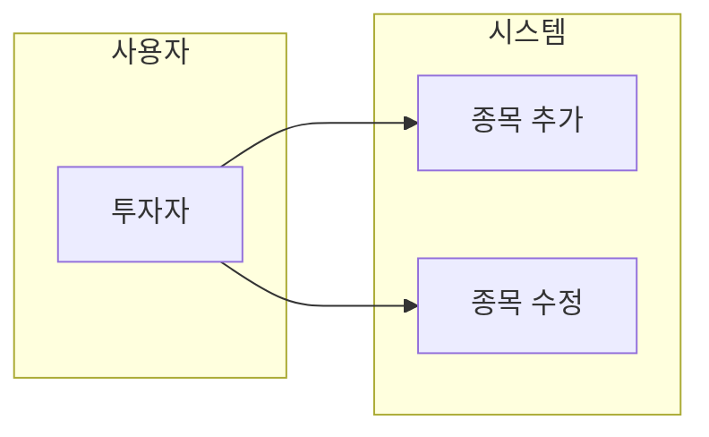
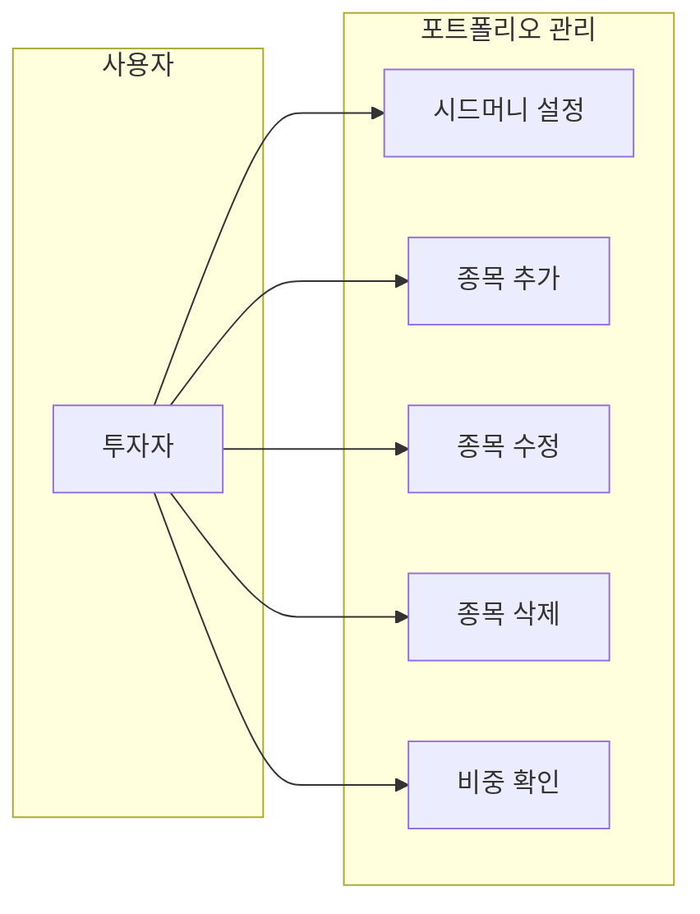
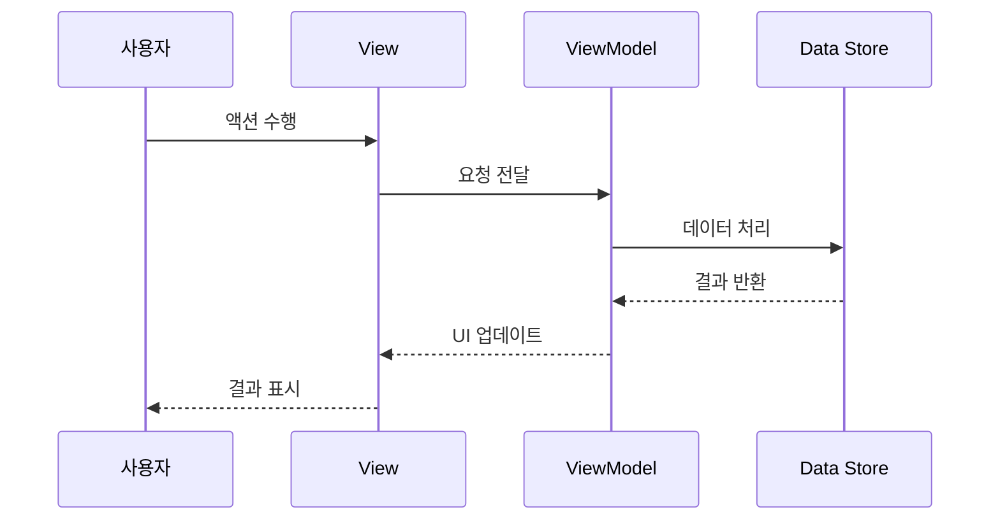
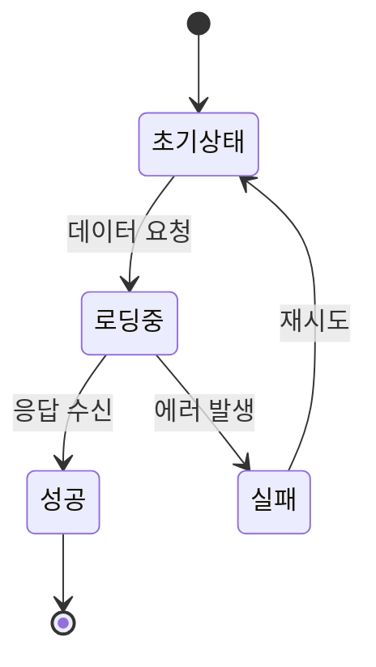

## 역할

개발 전 설계 단계의 모든 문서를 작성하고 관리합니다. 요구사항 정의부터 화면 설계, 유스케이스 분석까지 담당합니다.

## 담당 문서

**중요**: 기능 추가 시 반드시 아래 3개 문서만 작성합니다.

### 1. 유스케이스 명세서
사용자 시나리오와 시스템 동작을 정의합니다.

**파일 위치**: `docs/{메뉴명}/{기능명}/USECASE.md`

**포함 내용**:
- 유스케이스 다이어그램 (Mermaid)
- 시퀀스 다이어그램 (Mermaid)
- 각 유스케이스별 상세 시나리오 (표 형식)
- 정상 흐름 및 예외 흐름

**예시**:


### 2. 요구사항 정의서
기능별 요구사항을 체계적으로 정의합니다.

**파일 위치**: `docs/{메뉴명}/{기능명}/REQUIREMENTS.md`

**포함 내용**:
- 기능 개요 및 목적
- 기능 요구사항 (표 형식: 기능 ID, 기능명, 상세 설명, 우선순위)
- 비기능 요구사항 (표 형식: 카테고리, 요구사항, 목표 값)
- 데이터 모델 (표 형식: 모델명, 속성, 타입, 설명)
- 제약사항 (표 형식)
- 개발 우선순위 (표 형식)

### 3. 화면설계서
UI/UX 설계를 상세하게 기술합니다.

**파일 위치**: `docs/{메뉴명}/{기능명}/SCREEN_DESIGN.md`

**포함 내용**:
- 화면 레이아웃 (ASCII 다이어그램)
- UI 컴포넌트 상세 (텍스트 설명)
- 인터랙션 정의 (표 형식)
- 스타일 가이드 (표 형식: 색상, 타이포그래피, 스페이싱)
- 접근성 고려사항

## 문서 구조

**표준 구조**: 각 기능은 반드시 3개 문서로 구성

```
docs/
├── portfolio/                       # 포트폴리오 메뉴
│   └── {기능명}/
│       ├── USECASE.md              # 유스케이스 명세서
│       ├── REQUIREMENTS.md         # 요구사항 정의서
│       └── SCREEN_DESIGN.md        # 화면설계서
│
└── trading-journal/                 # 매매일지 메뉴
    ├── calendar/                    # 캘린더 기능
    │   ├── USECASE.md
    │   ├── REQUIREMENTS.md
    │   └── SCREEN_DESIGN.md
    │
    ├── entry/                       # 작성/리스트 기능
    │   ├── USECASE.md
    │   ├── REQUIREMENTS.md
    │   └── SCREEN_DESIGN.md
    │
    └── stock-selection/             # 종목 선택 기능
        ├── USECASE.md
        ├── REQUIREMENTS.md
        └── SCREEN_DESIGN.md
```

## 작업 프로세스

### 새 기능 설계 시
**필수 3단계 문서 작성**:

1. **유스케이스 명세서 작성** (`USECASE.md`)
   - 유스케이스 다이어그램 작성
   - 시퀀스 다이어그램 작성
   - 각 시나리오별 상세 흐름 정의

2. **요구사항 정의서 작성** (`REQUIREMENTS.md`)
   - 기능 목적과 범위 정의
   - 기능 요구사항 표 작성
   - 데이터 모델 표 작성
   - 우선순위 정의

3. **화면설계서 작성** (`SCREEN_DESIGN.md`)
   - UI 레이아웃 다이어그램
   - 컴포넌트 상세 설명
   - 스타일 가이드 표 작성

### 기능 변경 시
1. **변경 사항 분석**: 어떤 부분이 변경되었는지 파악
2. **문서 업데이트**: 변경된 내용을 3개 문서 중 해당 섹션에 반영
3. **일관성 검증**: 코드와 문서의 일치 여부 확인

## 문서 작성 원칙

- **명확성**: 개발자가 바로 구현할 수 있도록 구체적으로 작성
- **일관성**: 동일한 형식과 용어 사용
- **추적성**: 요구사항 → 설계 → 구현 연결 가능하도록
- **최신성**: 코드 변경 시 즉시 문서 업데이트
- **가독성**: 표 기반 작성으로 한눈에 파악 가능하도록

## 문서별 작성 가이드

### 요구사항 정의서 작성 규칙

**✅ 반드시 표(Table) 형식 사용**
- 기능 요구사항: 기능 ID, 기능명, 상세 설명, 우선순위 표
- 비기능 요구사항: 카테고리, 요구사항, 목표 값 표
- 데이터 모델: 모델명, 속성, 타입, 설명 표
- 제약사항: 항목, 제약 내용 표
- 개발 우선순위: Phase, 기능 ID, 기능명, 우선순위, 비고 표

**예시**:
```markdown
| 기능 ID | 기능명 | 상세 설명 | 우선순위 |
|---------|--------|-----------|----------|
| **FN-001** | 사용자 인증 | 로그인/로그아웃 기능 | P0 |
```

### 화면 설계서 작성 규칙

**❌ 소스 코드 포함 금지**
- SwiftUI, UIKit 등의 구체적인 코드 작성 금지
- 대신 구성 요소와 스타일을 텍스트/표로 설명

**✅ 작성해야 할 내용**:
- ASCII 다이어그램으로 레이아웃 시각화
- 구성 요소 목록 (텍스트)
- 스타일 가이드 (표 형식)
- 인터랙션 설명 (텍스트/표)

**예시**:
```markdown
**구성 요소**:
- 제목 라벨 (상단)
- 확인 버튼 (하단)

**스타일**:
- 폰트: `.headline` (16pt)
- 패딩: 12pt
```

## Mermaid 다이어그램 템플릿

### 유스케이스 다이어그램


### 시퀀스 다이어그램


### 상태 다이어그램


## 업데이트 체크리스트

**기능 추가 시 반드시 확인**:
- [ ] 3개 문서 모두 작성 완료 (USECASE.md, REQUIREMENTS.md, SCREEN_DESIGN.md)
- [ ] 유스케이스 다이어그램 작성
- [ ] 시퀀스 다이어그램 작성
- [ ] 요구사항 표 작성 (표 형식 필수)
- [ ] 데이터 모델 표 작성
- [ ] 화면 레이아웃 ASCII 다이어그램 작성
- [ ] 스타일 가이드 표 작성

**기능 변경 시 반드시 확인**:
- [ ] 변경된 내용이 3개 문서에 모두 반영
- [ ] 다이어그램 최신화
- [ ] 코드와 문서 일치 여부 검증
