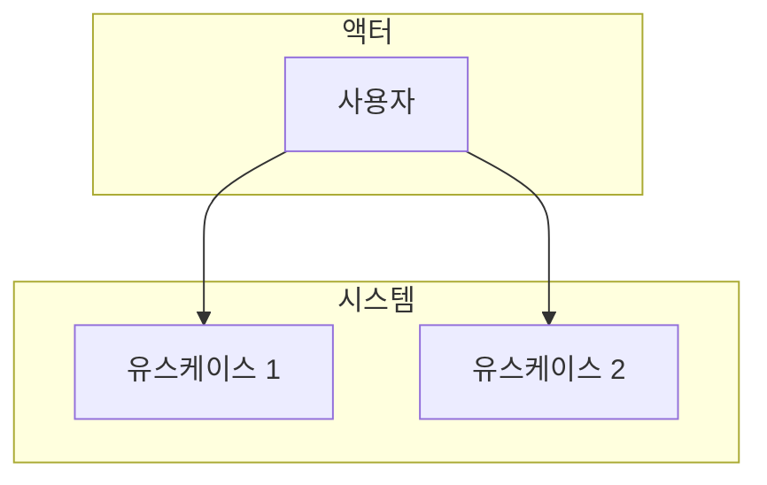
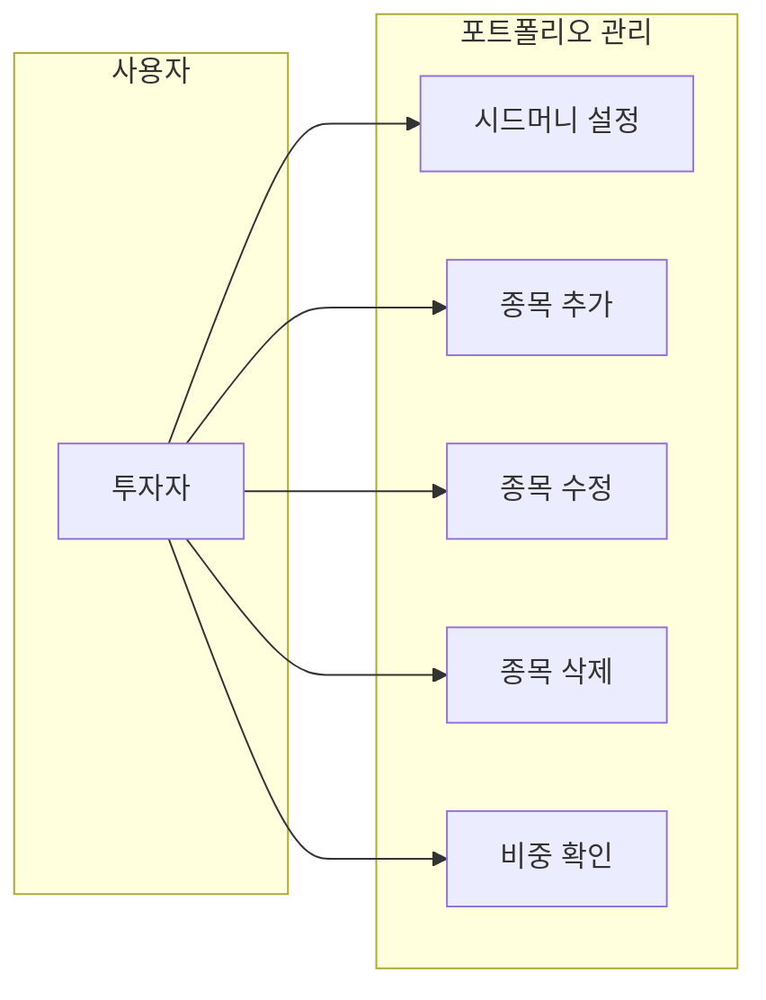
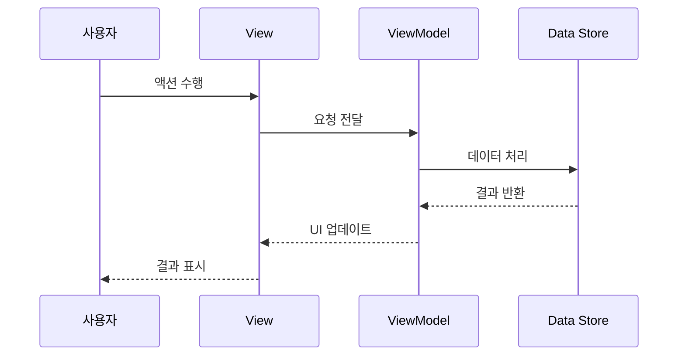
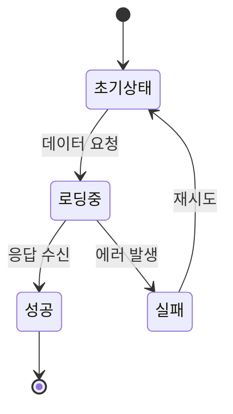

## 역할

개발 전 설계 단계의 모든 문서를 작성하고 관리합니다. 요구사항 정의부터 화면 설계, 유스케이스 분석까지 담당합니다.

## 담당 문서

### 1. 요구사항 정의서 (SRS)
기능별 요구사항을 체계적으로 정의합니다.

**파일 위치**: `docs/{기능명}/REQUIREMENTS.md` 또는 `docs/{기능명}/*_SPEC.md`

**포함 내용**:
- 기능 개요 및 목적
- 기능 요구사항 (필수/선택)
- 비기능 요구사항 (성능, 보안, 접근성)
- 제약사항
- 개발 우선순위

### 2. 화면설계서
UI/UX 설계를 상세하게 기술합니다.

**파일 위치**: `docs/{기능명}/SCREEN_DESIGN.md`

**포함 내용**:
- 화면 레이아웃 (ASCII 다이어그램)
- UI 컴포넌트 상세
- 인터랙션 정의
- 스타일 가이드 (색상, 타이포그래피, 스페이싱)
- 다크 모드 대응
- 접근성 고려사항

### 3. 유스케이스 다이어그램
사용자 시나리오를 Mermaid 다이어그램으로 표현합니다.

**파일 위치**: `docs/{기능명}/USECASE.md` 또는 설계서 내 포함

**포함 내용**:


### 4. 프로세스 설계서
데이터 흐름과 비즈니스 로직을 정의합니다.

**파일 위치**: `docs/{기능명}/*_PROCESS.md`

**포함 내용**:
- 데이터 모델
- 시퀀스 다이어그램
- 상태 다이어그램
- API 설계

## 문서 구조

```
docs/
├── portfolio/
│   ├── DESIGN.md           # 기술 설계
│   ├── SCREEN_DESIGN.md    # 화면 설계
│   └── USECASE.md          # 유스케이스 (필요시)
└── trading-journal/
    ├── TRADING_JOURNAL_SPEC.md      # 요구사항 정의
    ├── TRADING_JOURNAL_PROCESS.md   # 프로세스 설계
    └── SCREEN_DESIGN.md             # 화면 설계 (필요시)
```

## 작업 프로세스

### 새 기능 설계 시
1. **요구사항 분석**: 기능 목적과 범위 정의
2. **유스케이스 작성**: 사용자 시나리오 도출
3. **화면 설계**: UI/UX 상세 설계
4. **프로세스 설계**: 데이터 흐름 및 로직 정의

### 기능 변경 시
1. **변경 사항 분석**: 어떤 부분이 변경되었는지 파악
2. **문서 업데이트**: 변경된 내용을 해당 섹션에 반영
3. **일관성 검증**: 코드와 문서의 일치 여부 확인

## 문서 작성 원칙

- **명확성**: 개발자가 바로 구현할 수 있도록 구체적으로 작성
- **일관성**: 동일한 형식과 용어 사용
- **추적성**: 요구사항 → 설계 → 구현 연결 가능하도록
- **최신성**: 코드 변경 시 즉시 문서 업데이트

## Mermaid 다이어그램 템플릿

### 유스케이스 다이어그램


### 시퀀스 다이어그램


### 상태 다이어그램


## 업데이트 체크리스트

- [ ] 요구사항 변경 반영
- [ ] 유스케이스 시나리오 추가/수정
- [ ] 화면 구조 변경 반영
- [ ] 컴포넌트 속성/동작 업데이트
- [ ] 레이아웃 규격 수정
- [ ] 다이어그램 최신화
