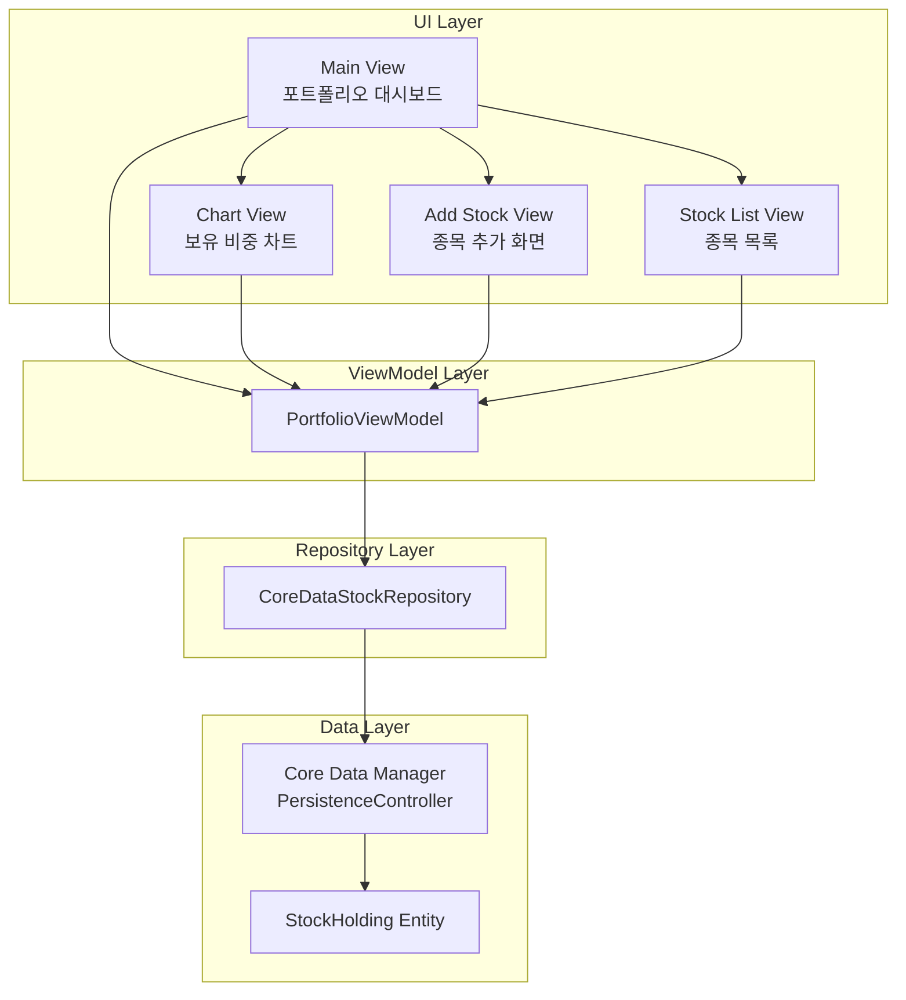
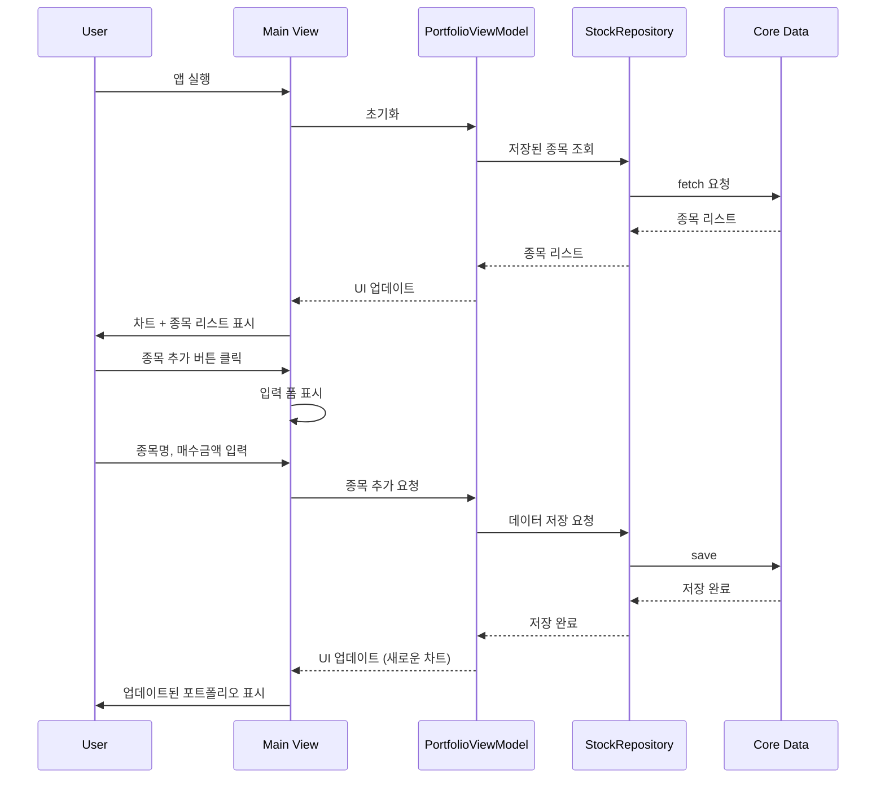

# Stock Portfolio iOS App - 설계 문서

## 1. 기술 스택

- **Language**: Swift 5.9+
- **UI Framework**: SwiftUI (iOS 16.0+)
- **Charts**: Swift Charts (Apple 공식, iOS 16+)
- **저장소**: Core Data
- **아키텍처**: MVVM 패턴

## 2. 핵심 기능

1. **시드머니 설정**: 총 투자 가능 금액 설정
2. **종목 입력**: 종목명과 매수 금액을 수동으로 입력
3. **투자 현황**: 시드머니 대비 투자 비율과 남은 현금 표시
4. **보유 비중 차트**: 파이 차트로 종목별 비중 시각화
5. **포트폴리오 리스트**: 종목별 매수 금액과 비중 표시

## 3. 앱 구성도



## 4. 데이터 흐름도



## 5. 화면 구성

### 5.1 메인 화면 (Main Dashboard)
- **Navigation Bar**:
  - 타이틀 없음 (숨김)
  - 우측에 설정(⚙️) 버튼만 표시
- **상단**: 투자 현황 (2단 카드)
  - 투자 금액 (비율)
  - 남은 현금 (비율)
- **중단**: 파이 차트 (종목별 비중)
  - 커스텀 범례 (2열 그리드)
- **하단**: 보유 종목 리스트
  - 섹션 헤더: "보유 종목 (표시개수/전체개수)"
  - **표시 제한**: 최대 6개까지만 기본 표시
  - **추가 표시**: 스크롤/슬라이드로 나머지 표시
  - 종목명, 매수 금액, 비중 (%)
- **숨김 요소**:
  - "총 시드머니" 레이블/금액만 숨김 (설정 화면에서 수정 가능)

### 5.2 시드머니 설정 화면
- 총 시드머니 입력 필드
- 저장 버튼
- Navigation Bar 우측에 설정 아이콘으로 접근

### 5.3 종목 추가 화면
- 종목명 입력 필드
- 매수 금액 입력 필드
- 저장 버튼
- 취소 버튼

### 5.4 종목 편집/삭제
- 스와이프로 삭제
- 탭하여 수정

## 6. 데이터 모델

```swift
// Core Data Entity
@Model
class StockHolding {
    var id: UUID
    var stockName: String       // 종목명
    var purchaseAmount: Double  // 매수 금액
    var createdAt: Date         // 생성일

    // 계산 속성
    var percentage: Double {    // 전체 포트폴리오 대비 비중
        // ViewModel에서 계산
    }
}

// ViewModel에서 사용할 Portfolio 모델
struct Portfolio {
    let holdings: [StockHolding]
    var seedMoney: Double  // UserDefaults에서 로드

    var totalInvestedAmount: Double {  // 투자한 금액
        holdings.reduce(0) { $0 + $1.purchaseAmount }
    }

    var remainingCash: Double {  // 남은 현금
        seedMoney - totalInvestedAmount
    }

    var investedPercentage: Double {  // 투자 비율
        guard seedMoney > 0 else { return 0 }
        return (totalInvestedAmount / seedMoney) * 100
    }

    var cashPercentage: Double {  // 현금 비율
        guard seedMoney > 0 else { return 0 }
        return (remainingCash / seedMoney) * 100
    }

    func percentage(for holding: StockHolding) -> Double {  // 종목별 비중
        guard totalInvestedAmount > 0 else { return 0 }
        return (holding.purchaseAmount / totalInvestedAmount) * 100
    }
}
```

## 7. 개발 우선순위

### Phase 1: MVP ✅
- [x] Xcode 프로젝트 생성 (SwiftUI, iOS 17.0+)
- [x] Core Data 모델 설정 (StockHolding Entity)
- [x] UserDefaults로 시드머니 저장/로드
- [x] 시드머니 설정 화면
- [x] 메인 화면 UI 구성 (시드머니 정보 포함)
- [x] 종목 추가 화면 구성
- [x] Core Data CRUD 기능 구현
- [x] 기본 리스트 표시

### Phase 2: 차트 구현 ✅
- [x] Swift Charts로 파이 차트 구현 (SectorMark)
- [x] 종목별 색상 자동 할당
- [x] 비중 레이블 표시
- [x] 차트 인터랙션 (탭, 하이라이트)

### Phase 3: UX 개선 ✅
- [x] 스와이프로 삭제 기능
- [x] 종목 편집 기능
- [x] 빈 상태 UI (종목이 없을 때)
- [x] 입력 검증 (음수 방지 등)
- [x] 애니메이션 추가
- [x] 다크 모드 지원

## 8. 폴더 구조 (포트폴리오 관련)

```
StockFolio/
├── Models/
│   ├── StockHoldingEntity.swift         # Core Data Entity
│   └── Portfolio.swift
├── Views/
│   ├── MainDashboardView.swift          # 포트폴리오 메인
│   ├── PortfolioChartView.swift         # 보유 비중 차트
│   ├── StockListView.swift              # 종목 목록
│   ├── AddStockView.swift               # 종목 추가
│   └── SeedMoneySettingsView.swift      # 시드머니 설정
├── ViewModels/
│   └── PortfolioViewModel.swift
├── Protocols/
│   └── StockRepositoryProtocol.swift
└── Services/
    ├── CoreDataStockRepository.swift
    └── SeedMoneyStorage.swift
```

## 9. UI/UX 디자인 가이드

### 색상
- 각 종목은 자동으로 구분 가능한 색상 할당
- SF Symbols 활용 (차트, 추가 버튼 등)

### 타이포그래피
- 제목: `.title`, `.title2`
- 금액: `.headline` (볼드), 숫자는 모노스페이스
- 비중: `.subheadline`

### 레이아웃
- 여백: 16pt (표준), 8pt (밀집)
- 코너 반경: 12pt (카드), 8pt (버튼)
- **보유 종목 리스트**: 최대 6개 표시, 스크롤로 나머지 접근
- **Navigation Bar**: 타이틀 숨김, 설정 버튼만 표시

### 화면 간소화
- "총 시드머니" 레이블/금액: 메인 화면에서 숨김
- 투자 금액/남은 현금: 2단 카드로 표시 유지
- 차트 중심 레이아웃: 파이 차트가 화면 중단에 배치
- 종목 리스트: 접힌 상태로 6개만 표시, 필요 시 확장

### 버튼 영역 구분선 및 여백
- **적용 화면**: AddStockView, SeedMoneySettingsView
- **구현**:
  - safeAreaInset 버튼 영역 상단에 0.5pt separator 라인 추가
  - `Color(.separator)` 사용으로 라이트/다크 모드 자동 대응
  - 구분선과 버튼 사이 16pt top padding 추가 (`.padding(.top, 16)`)
- **목적**:
  - 페이지 내용과 버튼 영역을 시각적으로 명확히 구분
  - 버튼 영역이 고정된 하단 액션 바임을 명확히 표현
  - 일관된 UI 패턴 적용으로 사용성 개선
  - 적절한 여백으로 시각적 호흡감 제공

### 저장 버튼 Disabled 스타일 개선
- **적용 화면**: AddStockView, SeedMoneySettingsView
- **변경 내용**:
  - **기존**: `isValidInput ? Color.accentColor : Color.gray` (회색으로 변경)
  - **개선**: `Color.accentColor` + `.opacity(isValidInput ? 1.0 : 0.5)` (투명도로 표현)
- **구현 방법**:
  ```swift
  .background(Color.accentColor)
  .opacity(isValidInput ? 1.0 : 0.5)
  ```
- **이점**:
  - 브랜드 일관성 유지: 버튼이 항상 브랜드 색상(accentColor)을 유지
  - 현대적 디자인: 투명도로 비활성 상태를 표현하는 것이 최신 트렌드
  - 시각적 연속성: 활성/비활성 상태 간 색상 변화 없이 자연스러운 전환
  - 사용자 경험: 버튼 위치와 기능이 색상 변화 없이 명확하게 인식됨

## 10. 향후 확장 가능성

- 매수일 추가 (날짜 기록)
- 메모 기능 (종목별 투자 사유)
- 카테고리 분류 (국내주식, 해외주식, 채권 등)
- CSV 내보내기/가져오기
- 위젯 지원 (iOS 홈 화면)
- iPad 지원 (멀티 컬럼 레이아웃)
- 차트 타입 선택 (파이/바/도넛 차트)
