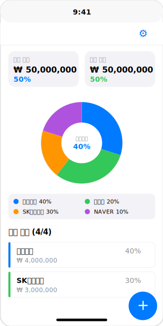
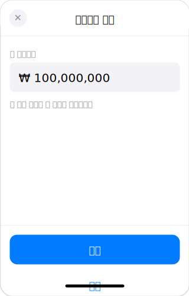
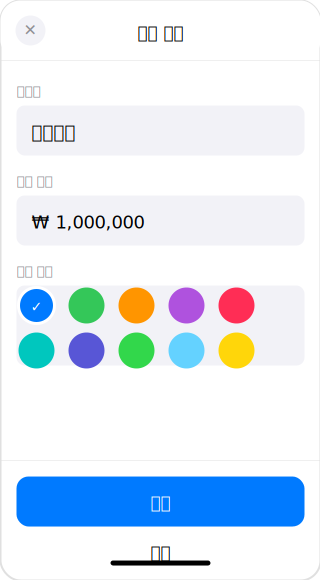
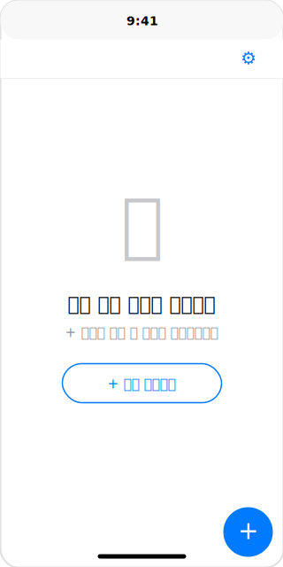

# Stock Portfolio App - 화면 설계서

## 문서 정보

**버전:** v2.0
**최종 수정일:** 2025-12-24
**작성자:** Claude Code

## 변경 이력

### v2.0 (2025-12-24)
- **매매일지 수준의 컴팩트 디자인 적용**
- 통계 섹션 강화 (StatCard 스타일 2x2 그리드)
- 종목 리스트 컴팩트화 (4pt 색상 바, 최소 패딩)
- 차트 범례 최적화 (FlowLayout, 토글 기능)
- 페이지네이션 명시화 (10개 단위)
- 스타일 가이드 표준화 (폰트, 패딩, 간격)
- 매매일지와 디자인 일관성 확보

### v1.1 (2025-12-24)
- draw.io 와이어프레임 이미지 추가
- 화면별 시각적 다이어그램 보강

### v1.0 (2025-12-24)
- 초기 작성
- 메인 화면, 시드머니 설정, 종목 추가/편집 화면 설계
- UI 컴포넌트 상세 정의 (Navigation Bar, 차트, 리스트)
- 컴팩트 디자인 원칙 적용

## 1. 메인 화면 (포트폴리오 대시보드)

### 1.1 레이아웃



<details>
<summary>ASCII 다이어그램 보기</summary>

```
┌─────────────────────────────────────┐
│                              ⚙️     │  ← Navigation Bar (타이틀 없음)
├─────────────────────────────────────┤
│   ┌───────────────┬───────────────┐ │
│   │ 투자 금액      │ 남은 현금      │ │  ← 2단 레이아웃
│   │ ₩ 50,000,000 │ ₩ 50,000,000  │ │
│   │ 50%          │ 50%           │ │  ← 비율 표시
│   └───────────────┴───────────────┘ │
│                                     │
│          [파이 차트]                  │
│                                     │
│      ●  삼성전자  40%                 │  ← 차트 중앙
│                                     │
│  ┌─────────────────────────────┐   │
│  │ ● 삼성전자 40%   ● 카카오 20% │   │  ← 커스텀 범례 (2열)
│  │ ● SK하이닉스 30% ● NAVER 10% │   │  ← 스크롤 가능
│  └─────────────────────────────┘   │
│                                     │
├─────────────────────────────────────┤
│  보유 종목 (6/10)                    │  ← 현재/전체 개수 표시
├─────────────────────────────────────┤
│  ┌───────────────────────────────┐  │
│  │ 삼성전자                    40% │  │
│  │ ₩ 4,000,000                   │  │  ← 종목 1
│  └───────────────────────────────┘  │
│  ┌───────────────────────────────┐  │
│  │ SK하이닉스                   30% │  │
│  │ ₩ 3,000,000                   │  │  ← 종목 2
│  └───────────────────────────────┘  │
│  ┌───────────────────────────────┐  │
│  │ 카카오                       20% │  │
│  │ ₩ 2,000,000                   │  │  ← 종목 3~6 (최대 6개)
│  └───────────────────────────────┘  │
│  ┌ ─ ─ ─ ─ ─ ─ ─ ─ ─ ─ ─ ─ ─ ─ ┐  │
│  │      ↓ 슬라이드하여 더 보기 ↓    │  │  ← 더보기 힌트 (6개 초과 시)
│  └ ─ ─ ─ ─ ─ ─ ─ ─ ─ ─ ─ ─ ─ ─ ┘  │
│                                     │
│              [ + ]                  │  ← Floating Action Button
└─────────────────────────────────────┘
```

</details>

### 1.2 UI 요소

#### Navigation Bar
- **제목**: 없음 (타이틀 숨김)
- **배경**: 투명
- **스타일**: Inline (타이틀 없이 툴바만 표시)
- **좌측 버튼**: ⚙️ (설정 아이콘)
  - SF Symbol: "gearshape.fill"
  - 액션: 시드머니 설정 시트 표시
- **우측 버튼**: + (종목 추가)
  - SF Symbol: "plus"
  - 액션: 종목 추가 시트 표시

#### 통계 섹션 (StatCard 스타일 - v2.0 개선)

**레이아웃**: 2x2 LazyVGrid (매매일지 StatCard 스타일 적용)

**4개 통계 카드 구성**:

1. **시드머니 카드**
   - 라벨: "시드머니" (`.caption2`, `.secondary`)
   - 값: "1,000,000원" (`.title2`, `.bold`, `.primary`)
   - 패딩: `12pt`
   - 배경: `.secondary.opacity(0.1)`
   - 코너 반경: `8pt`

2. **평가액 카드**
   - 라벨: "총 평가액" (`.caption2`, `.secondary`)
   - 값: "1,500,000원" (`.title2`, `.bold`, `.primary`)
   - 부가 정보: "+500,000원" (`.caption`, 빨강/파랑)
   - 간격: 라벨-값 `4pt`, 값-부가 `2pt`

3. **손익 카드**
   - 라벨: "총 손익" (`.caption2`, `.secondary`)
   - 값: "+500,000원" (`.title2`, `.bold`, 빨강/파랑)
   - 부가 정보: "+50.0%" (`.caption`, 빨강/파랑)
   - 색상 규칙: 수익 `.red`, 손실 `.blue`

4. **수익률 카드**
   - 라벨: "수익률" (`.caption2`, `.secondary`)
   - 값: "+50.0%" (`.title2`, `.bold`, 빨강/파랑)

**카드 공통 스타일**:
- 배경: `.secondary.opacity(0.1)`
- 코너 반경: `8pt`
- 내부 패딩: `12pt`
- 카드 간격: `12pt`
- 전체 패딩: `16pt` (좌우)

**레거시 레이아웃 (유지 가능)**:
- 2단 레이아웃 (투자/현금) → 통계 카드로 대체 권장
- 기존 InvestmentSummaryCard → StatCard 스타일로 마이그레이션

**인터랙션**:
- 시드머니 카드 탭 → 시드머니 편집 시트
- 나머지 카드 탭 → 시각적 피드백 (haptic)

#### 파이 차트 섹션
- **차트 크기**:
  - 레이아웃: AspectRatio 1:1 (정사각형)
  - 최대 높이: 250pt
  - 반응형: 화면 너비에 맞춰 자동 조정
- **타입**: Pie Chart (Swift Charts)
- **색상**:
  - 종목별 개별 색상 선택 가능 (10가지 색상 팔레트)
  - 차트와 보유 종목 리스트에서 동일한 색상 사용
  - 그라디언트 효과: 입체감 표현 (색상 → 색상.opacity(0.7))
- **정렬**: 비중 기준 내림차순 정렬
- **툴팁**:
  - **표시 조건**: 차트 또는 범례 클릭 시
  - **위치**: 차트 중앙 오버레이
  - **내용**:
    - 종목명 (색상 인디케이터 포함)
    - 투자금액 (통화 포맷)
    - 비중 (종목 색상으로 강조)
  - **스타일**:
    - 배경: .ultraThinMaterial
    - 테두리: 종목 색상.opacity(0.3), 1.5pt
    - 코너 반경: 12pt
    - 그림자: .black.opacity(0.2), radius 8, offset (0, 4)
    - 너비: 200pt
  - **애니메이션**: .scale + .opacity (0.3초)
- **인터랙션**:
  - 차트 클릭: 해당 종목 툴팁 표시
  - 범례 클릭: 해당 종목 툴팁 표시
  - 재클릭: 툴팁 숨김
  - 커스텀 범례 표시 (2열 그리드, 스크롤 가능)
- **시각 효과**:
  - 그림자: color: .black.opacity(0.15), radius: 8, offset: (0, 4)
  - 코너 반경: 4pt (각 섹터)
- **여백**: 상하 16pt
- **컨테이너**: 고정 높이 제거, 동적 높이 사용

#### 커스텀 범례 (Chart Legend)
- **레이아웃**: LazyVGrid (2열)
  - 컬럼: 2개의 flexible 컬럼
  - 간격: 12pt (horizontal), 8pt (vertical)
- **스크롤**:
  - ScrollView 활성화 (종목이 많을 경우)
  - 최대 높이: 제한 없음 (동적)
- **범례 아이템**:
  - 색상 인디케이터: 10x10pt 원형
  - 종목명: `.caption` 폰트
  - 비중: `.caption` 폰트, 회색
  - 레이아웃: HStack (색상 + 종목명 + 비중)
- **인터랙션**:
  - 클릭 시 해당 종목 툴팁 표시
  - 선택된 항목 배경 강조 (종목 색상.opacity(0.2))
  - 선택된 항목 테두리 (종목 색상, 2pt)
- **배경**:
  - 기본: Color(.tertiarySystemBackground)
  - 선택: 종목 색상.opacity(0.2)
- **여백**: 상 12pt

#### 보유 종목 리스트 (v2.0 컴팩트 디자인)

**섹션 헤더**:
- 텍스트: "보유 종목 (표시개수/전체개수)"
- 폰트: `.headline`
- 여백: 좌우 16pt, 상하 12pt
- 예시: "보유 종목 (10/25)" - 10개 초과 시만 개수 표시

**정렬**: 비중 기준 내림차순 (차트와 동일 순서)

**페이지네이션 (매매일지 스타일)**:
- **기본 표시**: 최대 10개
- **더보기 버튼**: 10개씩 추가 로드
- **접기 버튼**: 전체 로드 후 처음 10개로 축소
- **자동 로딩 금지**: 수동 버튼만 허용

**종목 카드 (컴팩트)**:

```
┌───────────────────────────────┐
│▌삼성전자        1,234,567원   │  ← 상단: 종목명/금액
│                 23.4%         │  ← 하단: 비중
└───────────────────────────────┘
```

**카드 구조**:
- **좌측 색상 바**:
  - 너비: `4pt` (기존 5pt → 4pt로 축소)
  - 높이: 전체
  - 색상: 종목 색상

- **종목명**:
  - 폰트: `.subheadline` (기존 `.headline` → 컴팩트화)
  - 색상: `.primary`
  - 위치: 좌측 상단

- **금액**:
  - 폰트: `.body`
  - 숫자: 모노스페이스
  - 색상: `.primary`
  - 위치: 우측 상단

- **비중**:
  - 폰트: `.caption` (기존 `.headline` → 컴팩트화)
  - 색상: `.secondary`
  - 위치: 우측 하단

**카드 스타일**:
- 배경: `.secondary.opacity(0.05)`
- 코너 반경: `10pt`
- 내부 패딩: `10pt` (기존 16pt → 컴팩트화)
- 카드 간격: `8pt`
- 요소 간격: `6pt`

**페이지네이션 버튼**:

**더보기 버튼** (10개 초과 시):
```
┌─────────────────────────────────┐
│  ↓ 더보기 (15개 더 있음)        │
└─────────────────────────────────┘
```
- 폰트: `.subheadline`
- 색상: `.blue`
- 높이: `44pt`

**접기 버튼** (전체 로드 후):
```
┌─────────────────────────────────┐
│  ↑ 접기                         │
└─────────────────────────────────┘
```
- 폰트: `.subheadline`
- 색상: `.blue`
- 높이: `44pt`
- 애니메이션: `.easeInOut (0.3초)`

### 1.3 인터랙션

- **설정 버튼 (⚙️)**: 네비게이션 바 좌측, 시드머니 설정 시트 표시
- **+ 버튼**: 네비게이션 바 우측, 종목 추가 시트 표시
- **종목 카드 탭**: 종목 편집 시트 표시
- **종목 카드 길게 누르기**: 삭제 옵션 (haptic 피드백)
- **차트 탭**: 해당 종목 하이라이트
- **범례 탭**: 해당 종목 툴팁 표시
- **더보기 버튼**: 10개씩 추가 로드
- **접기 버튼**: 처음 10개로 축소

---

## 2. 시드머니 설정 화면 (Sheet)

### 2.1 레이아웃



<details>
<summary>ASCII 다이어그램 보기</summary>

```
┌─────────────────────────────────────┐
│  ✕  시드머니 설정                     │  ← Sheet Header
├─────────────────────────────────────┤
│ ┌─────────────────────────────────┐ │
│ │                                 │ │  ← ScrollView 시작
│ │   총 시드머니                     │ │
│ │   ┌───────────────────────────┐ │ │
│ │   │ ₩ 100,000,000             │ │ │  ← TextField (숫자)
│ │   └───────────────────────────┘ │ │
│ │                                 │ │
│ │   💡 투자 가능한 총 금액을 입력하세요│ │  ← 안내 문구
│ │                                 │ │
│ └─────────────────────────────────┘ │  ← ScrollView 끝
│                                     │
│   ┌─────────────────────────────┐   │  ← safeAreaInset 영역
│   │        저장                  │   │  ← Primary Button
│   └─────────────────────────────┘   │
│                                     │
│   ┌─────────────────────────────┐   │
│   │        취소                  │   │  ← Secondary Button
│   └─────────────────────────────┘   │
└─────────────────────────────────────┘
```

</details>

### 2.2 UI 요소

#### 레이아웃 구조
- **구조**: ScrollView + safeAreaInset
  - ScrollView: 입력 필드와 안내 문구 포함
  - safeAreaInset: 버튼 영역 (항상 하단 고정)
- **장점**:
  - 키보드 표시 시 자동 스크롤
  - 버튼 항상 접근 가능
  - 작은 화면 대응

#### Sheet Header
- **좌측**: ✕ 버튼 (닫기)
- **중앙**: "시드머니 설정" 제목
  - 폰트: `.headline`
- **높이**: 60pt

#### 시드머니 입력
- **레이블**: "총 시드머니"
  - 폰트: `.subheadline`
  - 색상: `.secondary`
- **TextField**:
  - Placeholder: "₩ 0"
  - 키보드: 숫자 패드
  - 배경: 시스템 회색 배경
  - 패딩: 12pt
  - 코너 반경: 8pt
  - 포맷: 통화 포맷 (자동 천단위 구분)

#### 안내 문구
- **텍스트**: "💡 투자 가능한 총 금액을 입력하세요"
- **폰트**: `.footnote`
- **색상**: `.secondary`

#### 버튼 영역
- **레이아웃**: safeAreaInset (하단 고정)
- **상단 구분선**:
  - 두께: 0.5pt
  - 색상: `Color(.separator)` (라이트/다크 모드 자동 대응)
  - 목적: 페이지 내용과 버튼 영역 시각적 구분
- **상단 여백**: 16pt (구분선과 버튼 사이)

#### 저장 버튼
- **스타일**: Prominent Button
- **배경**: `.accentColor` (파란색)
- **텍스트**: "저장" (흰색, `.headline`)
- **높이**: 50pt
- **코너 반경**: 12pt
- **상태**:
  - 비활성: 금액이 0 이하일 때 (투명도 0.5로 표시)
  - 활성: 금액 입력 완료 (투명도 1.0)
- **Disabled 스타일**:
  - 기존: 회색 배경 (`Color.gray`)
  - 개선: 브랜드 색상 유지 + 투명도 조절 (`Color.accentColor` + `.opacity(isValidInput ? 1.0 : 0.5)`)
  - 이점: 브랜드 일관성 유지, 현대적 디자인 패턴

#### 취소 버튼
- **스타일**: Secondary Button
- **배경**: 투명
- **텍스트**: "취소" (`.accentColor`, `.headline`)
- **높이**: 50pt
- **액션**: 시트 닫기

### 2.3 인터랙션

- **입력 검증**:
  - 금액: 0보다 커야 함, 음수 불가
  - 조건 미충족 시 저장 버튼 비활성화
- **저장 액션**:
  1. UserDefaults에 저장
  2. 시트 닫기
  3. 메인 화면 자동 업데이트
- **취소 액션**: 시트 닫기 (저장 안 함)

---

## 3. 종목 추가 화면 (Sheet)

### 3.1 레이아웃



<details>
<summary>ASCII 다이어그램 보기</summary>

```
┌─────────────────────────────────────┐
│  ✕  종목 추가                        │  ← Sheet Header
├─────────────────────────────────────┤
│ ┌─────────────────────────────────┐ │
│ │                                 │ │  ← ScrollView 시작
│ │   종목명                         │ │
│ │   ┌───────────────────────────┐ │ │
│ │   │ 삼성전자                   │ │ │  ← TextField
│ │   └───────────────────────────┘ │ │
│ │                                 │ │
│ │   매수 금액                      │ │
│ │   ┌───────────────────────────┐ │ │
│ │   │ ₩ 1,000,000               │ │ │  ← TextField (숫자)
│ │   └───────────────────────────┘ │ │
│ │                                 │ │
│ └─────────────────────────────────┘ │  ← ScrollView 끝
│                                     │
│   ┌─────────────────────────────┐   │  ← safeAreaInset 영역
│   │        저장                  │   │  ← Primary Button
│   └─────────────────────────────┘   │
│                                     │
│   ┌─────────────────────────────┐   │
│   │        취소                  │   │  ← Secondary Button
│   └─────────────────────────────┘   │
└─────────────────────────────────────┘
```

</details>

### 3.2 UI 요소

#### 레이아웃 구조
- **구조**: ScrollView + safeAreaInset
  - ScrollView: 입력 필드 포함
  - safeAreaInset: 버튼 영역 (항상 하단 고정)
- **장점**:
  - 키보드 표시 시 자동 스크롤
  - 버튼 항상 접근 가능
  - 작은 화면 대응

#### Sheet Header
- **좌측**: ✕ 버튼 (닫기)
- **중앙**: "종목 추가" 제목
  - 폰트: `.headline`
- **높이**: 60pt

#### 종목명 입력
- **레이블**: "종목명"
  - 폰트: `.subheadline`
  - 색상: `.secondary`
- **TextField**:
  - Placeholder: "예: 삼성전자"
  - 키보드: 기본 키보드
  - 배경: 시스템 회색 배경
  - 패딩: 12pt
  - 코너 반경: 8pt

#### 매수 금액 입력
- **레이블**: "매수 금액"
  - 폰트: `.subheadline`
  - 색상: `.secondary`
- **TextField**:
  - Placeholder: "₩ 0"
  - 키보드: 숫자 패드 (천단위 콤마 자동)
  - 배경: 시스템 회색 배경
  - 패딩: 12pt
  - 코너 반경: 8pt
  - 포맷: 통화 포맷 (자동 천단위 구분)

#### 색상 선택
- **레이블**: "차트 색상"
  - 폰트: `.subheadline`
  - 색상: `.secondary`
- **색상 그리드**:
  - 레이아웃: LazyVGrid (5개 컬럼)
  - 간격: 12pt
  - 색상 선택기: 40x40pt 원형
  - 선택 표시: 체크마크 아이콘 + 3pt 테두리
  - 배경: 시스템 회색 배경
  - 패딩: 전체 12pt
  - 코너 반경: 8pt

#### 버튼 영역
- **레이아웃**: safeAreaInset (하단 고정)
- **표시 조건**: 입력창 포커스 시에만 표시
- **애니메이션**:
  - 효과: offset + opacity
  - offset(y): 포커스 시 0, 미포커스 시 200
  - opacity: 포커스 시 1, 미포커스 시 0
  - 타입: .interactiveSpring()
- **상단 구분선**:
  - 두께: 0.5pt
  - 색상: `Color(.separator)` (라이트/다크 모드 자동 대응)
  - 목적: 페이지 내용과 버튼 영역 시각적 구분
- **상단 여백**: 16pt (구분선과 버튼 사이)

#### 저장 버튼
- **스타일**: Prominent Button
- **배경**: `.accentColor` (파란색)
- **텍스트**: "저장" (흰색, `.headline`)
- **높이**: 50pt
- **코너 반경**: 12pt
- **상태**:
  - 비활성: 종목명 또는 금액이 비어있을 때 (투명도 0.5로 표시)
  - 활성: 모든 필드 입력 완료 (투명도 1.0)
- **Disabled 스타일**:
  - 기존: 회색 배경 (`Color.gray`)
  - 개선: 브랜드 색상 유지 + 투명도 조절 (`Color.accentColor` + `.opacity(isValidInput ? 1.0 : 0.5)`)
  - 이점: 브랜드 일관성 유지, 현대적 디자인 패턴

#### 완료 버튼
- **스타일**: Secondary Button
- **배경**: 투명
- **텍스트**: "완료" (`.primary`, `.headline`)
- **높이**: 50pt
- **액션**: 키보드와 버튼 숨김 (focusedField = nil)

### 2.3 인터랙션

- **입력 검증**:
  - 종목명: 공백 불가
  - 금액: 0보다 커야 함, 음수 불가
  - 조건 미충족 시 저장 버튼 비활성화
- **저장 액션**:
  1. Core Data에 저장
  2. 시트 닫기
  3. 메인 화면 자동 업데이트 (애니메이션)
- **빈 영역 터치**: 키보드와 버튼 숨김 (focusedField = nil)
- **버튼 표시/숨김**:
  - 포커스 시: 저장/완료 버튼 표시 (offset 0, opacity 1)
  - 비포커스 시: 버튼 숨김 (offset 200, opacity 0)

---

## 4. 종목 편집 화면 (Sheet)

### 3.1 레이아웃

종목 추가 화면과 동일하되:
- **제목**: "종목 편집"
- **기본값**: 기존 데이터로 채워짐
- **삭제 버튼**: 제거됨 (스와이프 삭제로 대체)

```
┌─────────────────────────────────────┐
│  ✕  종목 편집                        │
├─────────────────────────────────────┤
│   ... (종목 추가와 동일) ...         │
│                                     │
│   ┌─────────────────────────────┐   │
│   │        저장                  │   │
│   └─────────────────────────────┘   │
│                                     │
│   ┌─────────────────────────────┐   │
│   │        취소                  │   │
│   └─────────────────────────────┘   │
│                                     │
│   ⚠️ 삭제는 리스트에서 스와이프       │
└─────────────────────────────────────┘
```

### 3.2 추가 요소

#### 삭제 버튼 (제거됨)
- 종목 편집 화면에서 삭제 버튼이 제거됨
- **삭제 방법**: 종목 리스트에서 스와이프하여 삭제
- 스와이프 삭제가 더 직관적인 UX 제공

---

## 5. 빈 상태 화면

### 5.1 레이아웃



<details>
<summary>ASCII 다이어그램 보기</summary>

```
┌─────────────────────────────────────┐
│                              ⚙️     │  ← Navigation Bar (타이틀 없음)
├─────────────────────────────────────┤
│                                     │
│                                     │
│                                     │
│           📊                        │  ← SF Symbol
│                                     │
│      아직 보유 종목이 없습니다         │  ← 제목
│                                     │
│   + 버튼을 눌러 첫 종목을 추가해보세요  │  ← 설명
│                                     │
│                                     │
│   ┌─────────────────────────────┐   │
│   │    + 종목 추가하기            │   │  ← CTA 버튼
│   └─────────────────────────────┘   │
│                                     │
│                                     │
│                                     │
│                                     │
│              [ + ]                  │
└─────────────────────────────────────┘
```

</details>

### 5.2 UI 요소

#### 아이콘
- **심볼**: SF Symbol "chart.pie.fill"
- **크기**: 80x80pt
- **색상**: `.secondary` (회색)

#### 제목
- **텍스트**: "아직 보유 종목이 없습니다"
- **폰트**: `.title2`, `.semibold`
- **색상**: `.primary`

#### 설명
- **텍스트**: "+ 버튼을 눌러 첫 종목을 추가해보세요"
- **폰트**: `.body`
- **색상**: `.secondary`

#### CTA 버튼
- **스타일**: Bordered Button
- **텍스트**: "+ 종목 추가하기"
- **테두리**: `.accentColor`
- **액션**: 종목 추가 시트 표시

---

## 6. 색상 시스템

### 5.1 차트 색상 팔레트 (순서대로 자동 할당)

1. **파란색**: `Color.blue`
2. **초록색**: `Color.green`
3. **주황색**: `Color.orange`
4. **보라색**: `Color.purple`
5. **분홍색**: `Color.pink`
6. **시안색**: `Color.cyan`
7. **인디고**: `Color.indigo`
8. **민트색**: `Color.mint`
9. **청록색**: `Color.teal`
10. **노란색**: `Color.yellow`

### 5.2 시스템 색상

- **Primary**: `.primary` (다크모드 대응)
- **Secondary**: `.secondary`
- **Background**: `.systemBackground`
- **Card**: `.secondarySystemBackground`
- **Accent**: `.blue` (또는 사용자 지정 색상)

---

## 7. 타이포그래피

| 요소 | 폰트 스타일 | 크기 | 굵기 |
|------|-----------|------|------|
| Navigation Title | `.largeTitle` | 34pt | Regular |
| 총 투자 금액 | `.largeTitle` | 34pt | Bold |
| 섹션 헤더 | `.headline` | 17pt | Semibold |
| 종목명 | `.headline` | 17pt | Semibold |
| 금액 | `.subheadline` | 15pt | Regular |
| 비중 | `.headline` | 17pt | Regular |
| 버튼 텍스트 | `.headline` | 17pt | Semibold |
| 레이블 | `.subheadline` | 15pt | Regular |
| 빈 상태 제목 | `.title2` | 22pt | Semibold |
| 빈 상태 설명 | `.body` | 17pt | Regular |

---

## 8. 스페이싱 & 레이아웃

### 7.1 여백 (Padding)
- **섹션 간**: 24pt
- **카드 간**: 8pt
- **화면 좌우**: 16pt
- **카드 내부**: 16pt
- **텍스트 그룹**: 4pt

### 7.2 크기
- **버튼 높이**: 50pt
- **카드 최소 높이**: 60pt
- **차트 크기**:
  - AspectRatio: 1:1 (정사각형)
  - 최대 높이: 250pt
  - 동적 크기 조정 (화면 너비 기반)
- **FAB 크기**: 56x56pt
- **범례 색상 인디케이터**: 8x8pt (원형)

### 7.3 코너 반경
- **카드**: 12pt
- **버튼**: 12pt
- **TextField**: 8pt
- **FAB**: 28pt (원형)

---

## 9. 애니메이션

### 8.1 화면 전환
- **Sheet 표시/닫기**: 기본 슬라이드 애니메이션
- **리스트 아이템 추가**: Fade + Slide from bottom (0.3초)
- **리스트 아이템 삭제**: Fade + Slide to trailing (0.3초)

### 8.2 차트 업데이트
- **데이터 변경 시**: Smooth transition (0.5초)
- **이징**: `.easeInOut`

### 8.3 인터랙션
- **버튼 탭**: Scale down (0.95) + 스프링 애니메이션
- **FAB**: Bounce 효과

---

## 10. 다크 모드

### 9.1 자동 대응
- 모든 색상은 시스템 색상 사용
- `.primary`, `.secondary`, `.systemBackground` 자동 전환

### 9.2 차트 색상
- 라이트/다크 모드 모두에서 가시성 유지
- 필요시 색상 밝기 자동 조정

---

## 11. 접근성 (Accessibility)

### 10.1 VoiceOver
- 모든 버튼에 적절한 레이블 제공
- 차트 데이터는 텍스트로도 읽을 수 있도록

### 10.2 Dynamic Type
- 모든 텍스트는 사용자 설정 폰트 크기에 대응

### 10.3 색상 대비
- WCAG AA 기준 충족 (4.5:1 이상)

