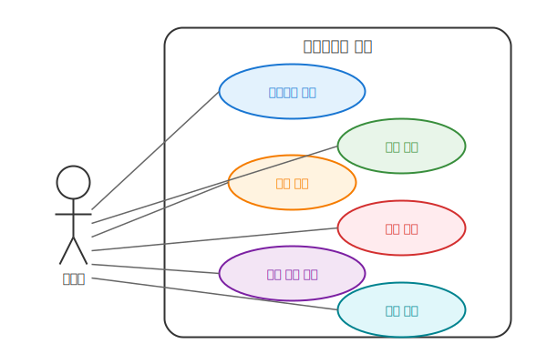
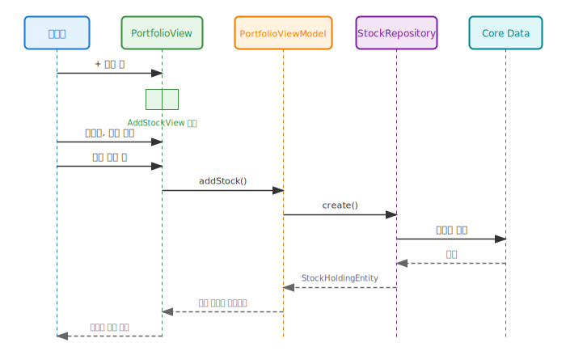
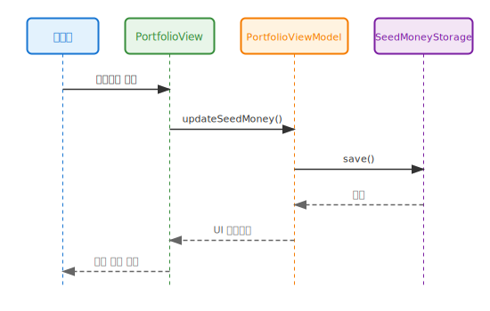
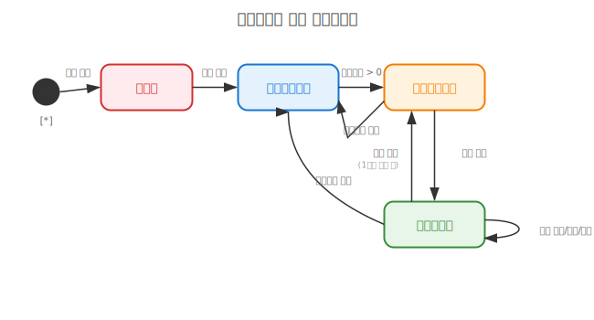

# 포트폴리오 관리 유스케이스 명세서

## 문서 정보

**버전:** v1.2
**최종 수정일:** 2024-12-24
**작성자:** Claude Code

## 변경 이력

### v1.2 (2024-12-24)
- **UI 개선 유스케이스 추가**
- 컴팩트 통계 섹션 조회 유스케이스
- 페이지네이션 유스케이스 (10개 단위)
- 매매일지 수준의 디자인 일관성 시나리오

### v1.1 (2024-12-24)
- Mermaid 다이어그램을 draw.io SVG 이미지로 변환
- 유스케이스, 시퀀스, 상태 다이어그램 시각화 개선

### v1.0 (2024-12-24)
- 초기 작성
- 포트폴리오 관리 핵심 유스케이스 정의 (시드머니 설정, 종목 CRUD, 보유 비중 확인)
- 시퀀스 다이어그램 및 상태 다이어그램 작성

## 1. 유스케이스 다이어그램

## 2. 시퀀스 다이어그램

### 2.1 종목 추가 플로우

### 2.2 시드머니 설정 플로우

## 3. 유스케이스 상세

### UC-1: 시드머니 설정

| 항목 | 내용 |
|------|------|
| **액터** | 투자자 |
| **사전조건** | 앱 실행 |
| **정상흐름** | 1. 사용자가 시드머니 입력 필드를 탭 2. 금액 입력 3. 자동 저장 4. 투자 현황 즉시 업데이트 |
| **예외흐름** | E1. 음수 입력 시 에러 표시 E2. 범위 초과 시 최대값 적용 |
| **사후조건** | 시드머니가 UserDefaults에 저장됨 |

### UC-2: 종목 추가

| 항목 | 내용 |
|------|------|
| **액터** | 투자자 |
| **사전조건** | 시드머니 설정 완료 |
| **정상흐름** | 1. + 버튼 탭 2. 종목명, 금액, 색상 입력 3. 저장 버튼 탭 4. 유효성 검증 통과 5. Core Data 저장 6. 목록에 종목 추가 |
| **예외흐름** | E1. 필수 항목 미입력 시 저장 버튼 비활성화 E2. 중복 종목명 허용 (추가 매수) |
| **사후조건** | 종목이 Core Data에 저장되고 목록에 표시됨 |

### UC-3: 종목 수정

| 항목 | 내용 |
|------|------|
| **액터** | 투자자 |
| **사전조건** | 종목 1개 이상 존재 |
| **정상흐름** | 1. 종목 카드 탭 2. 수정 화면 표시 3. 데이터 수정 4. 저장 5. 목록 갱신 |
| **예외흐름** | E1. 유효하지 않은 데이터 입력 시 저장 불가 |
| **사후조건** | 수정된 종목 정보가 Core Data에 저장됨 |

### UC-4: 종목 삭제

| 항목 | 내용 |
|------|------|
| **액터** | 투자자 |
| **사전조건** | 종목 1개 이상 존재 |
| **정상흐름** | 1. 종목 카드를 좌측으로 스와이프 2. 삭제 버튼 탭 3. Core Data에서 삭제 4. 목록에서 제거 |
| **예외흐름** | 없음 |
| **사후조건** | 종목이 Core Data에서 삭제됨 |

### UC-5: 보유 비중 확인

| 항목 | 내용 |
|------|------|
| **액터** | 투자자 |
| **사전조건** | 종목 1개 이상 존재 |
| **정상흐름** | 1. 파이 차트 확인 2. 종목별 비중 확인 3. 리스트에서 금액/비율 확인 |
| **예외흐름** | E1. 종목 없을 시 빈 차트 표시 |
| **사후조건** | 없음 (조회만) |

## 4. 상태 다이어그램

### 포트폴리오 상태

