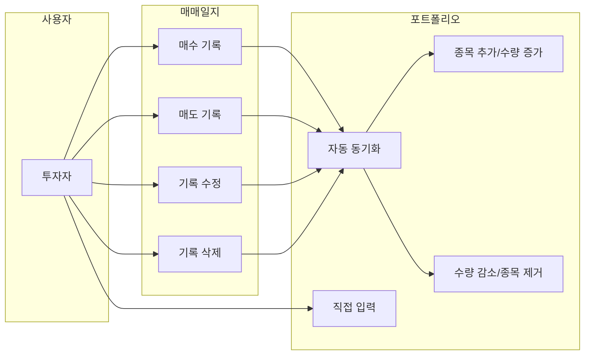
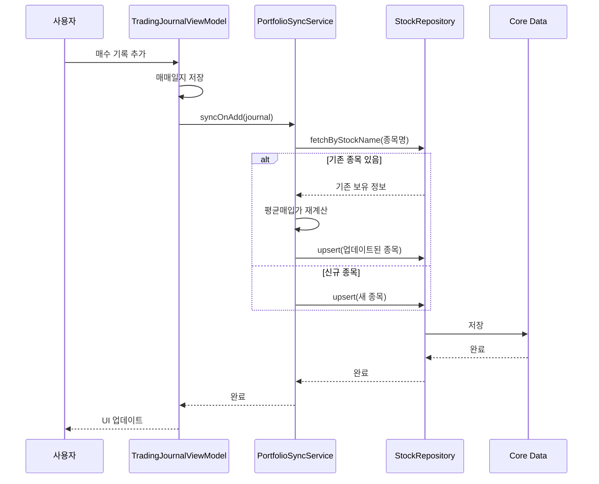
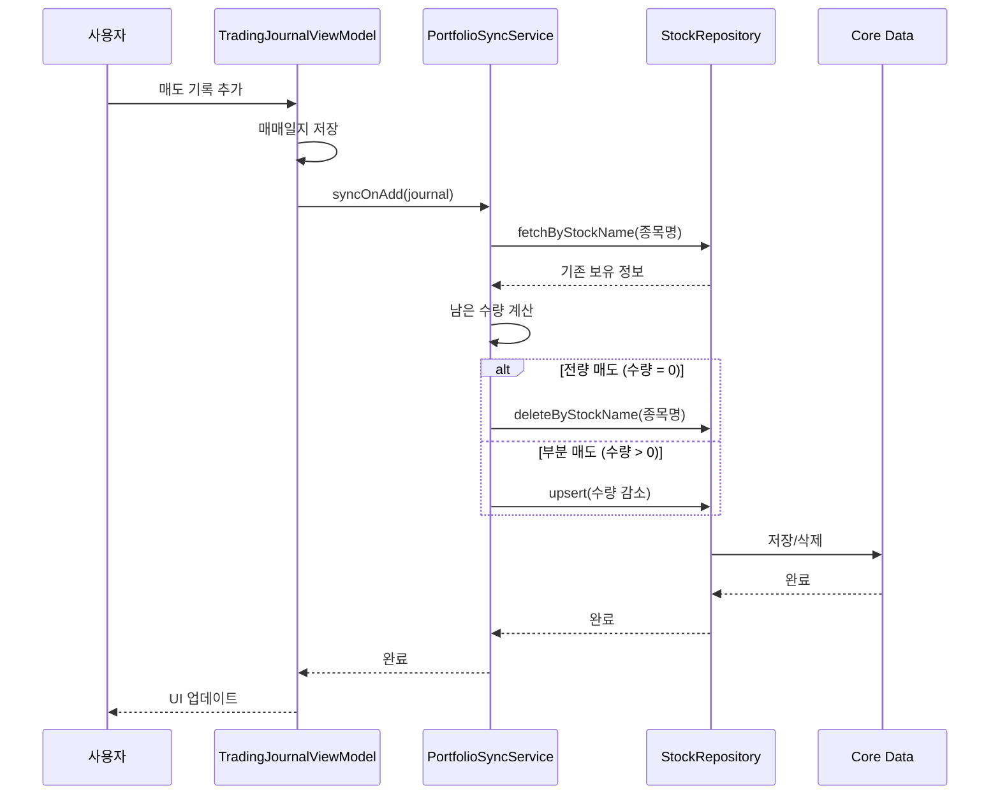
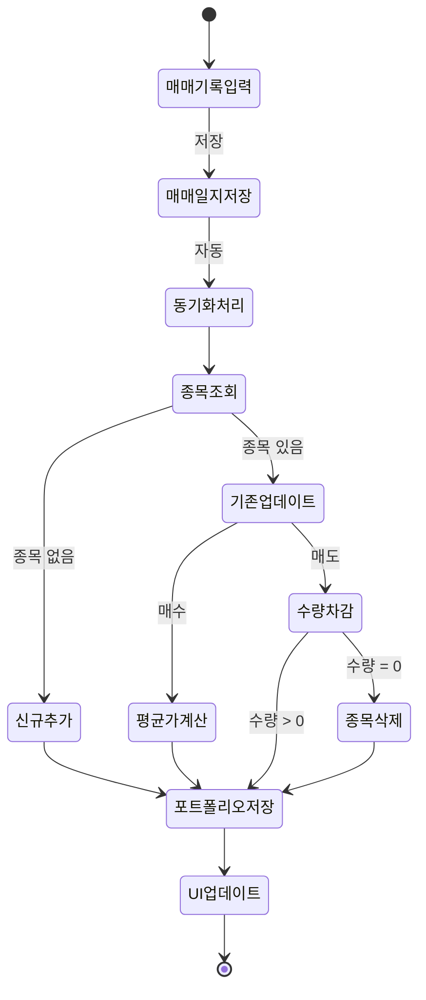

# 매매일지-포트폴리오 자동 동기화 유스케이스 명세서

## 문서 정보

**버전:** v1.0
**최종 수정일:** 2024-12-30
**작성자:** Claude Code

## 변경 이력

### v1.0 (2024-12-30)
- 초기 작성
- 매매일지-포트폴리오 자동 동기화 기능 설계

---

## 1. 유스케이스 다이어그램

## 2. 시퀀스 다이어그램

### 2.1 매수 기록 시 동기화

### 2.2 매도 기록 시 동기화

## 3. 유스케이스 상세 시나리오

### UC-01: 매수 기록 추가

| 항목 | 내용 |
|------|------|
| **유스케이스 ID** | UC-01 |
| **유스케이스명** | 매수 기록 추가 시 포트폴리오 동기화 |
| **액터** | 투자자 |
| **선행조건** | 앱에 로그인된 상태 |
| **트리거** | 매매일지에 매수 기록 저장 |

**정상 흐름 (신규 종목)**
1. 사용자가 매매일지에 매수 기록 입력
2. 시스템이 매매일지 저장
3. 시스템이 동일 종목 포트폴리오 조회
4. 동일 종목 없음 확인
5. 새 종목으로 포트폴리오에 추가 (수량, 평균가, 색상 자동 할당)
6. UI 업데이트

**대안 흐름 (기존 종목)**
4a. 동일 종목 존재 확인
5a. 평균매입가 재계산: `(기존금액 + 신규금액) / (기존수량 + 신규수량)`
6a. 포트폴리오 업데이트

### UC-02: 매도 기록 추가

| 항목 | 내용 |
|------|------|
| **유스케이스 ID** | UC-02 |
| **유스케이스명** | 매도 기록 추가 시 포트폴리오 동기화 |
| **액터** | 투자자 |
| **선행조건** | 포트폴리오에 해당 종목 보유 |
| **트리거** | 매매일지에 매도 기록 저장 |

**정상 흐름 (부분 매도)**
1. 사용자가 매매일지에 매도 기록 입력
2. 시스템이 매매일지 저장
3. 시스템이 포트폴리오에서 종목 조회
4. 남은 수량 = 기존 수량 - 매도 수량
5. 포트폴리오 수량 업데이트 (평균가 유지)
6. UI 업데이트

**대안 흐름 (전량 매도)**
4a. 남은 수량 = 0
5a. 포트폴리오에서 종목 삭제

### UC-03: 매매 기록 수정

| 항목 | 내용 |
|------|------|
| **유스케이스 ID** | UC-03 |
| **유스케이스명** | 매매 기록 수정 시 포트폴리오 재동기화 |
| **액터** | 투자자 |
| **트리거** | 기존 매매 기록 수정 |

**정상 흐름**
1. 사용자가 기존 매매 기록 수정
2. 시스템이 이전 매매 영향 취소 (역방향 처리)
3. 시스템이 새 매매 영향 적용
4. 포트폴리오 업데이트

### UC-04: 매매 기록 삭제

| 항목 | 내용 |
|------|------|
| **유스케이스 ID** | UC-04 |
| **유스케이스명** | 매매 기록 삭제 시 포트폴리오 재동기화 |
| **액터** | 투자자 |
| **트리거** | 매매 기록 삭제 |

**정상 흐름**
1. 사용자가 매매 기록 삭제
2. 시스템이 해당 매매 영향 취소 (역방향 처리)
3. 포트폴리오 업데이트

### UC-05: 종목 직접 입력

| 항목 | 내용 |
|------|------|
| **유스케이스 ID** | UC-05 |
| **유스케이스명** | 포트폴리오에 종목 직접 입력 |
| **액터** | 투자자 |
| **트리거** | 포트폴리오 화면에서 종목 추가 |

**정상 흐름**
1. 사용자가 포트폴리오에서 + 버튼 클릭
2. 종목명, 수량, 평균매입가 입력
3. 저장 시 포트폴리오에 직접 추가
4. (매매일지에는 기록되지 않음)

---

## 4. 상태 다이어그램

