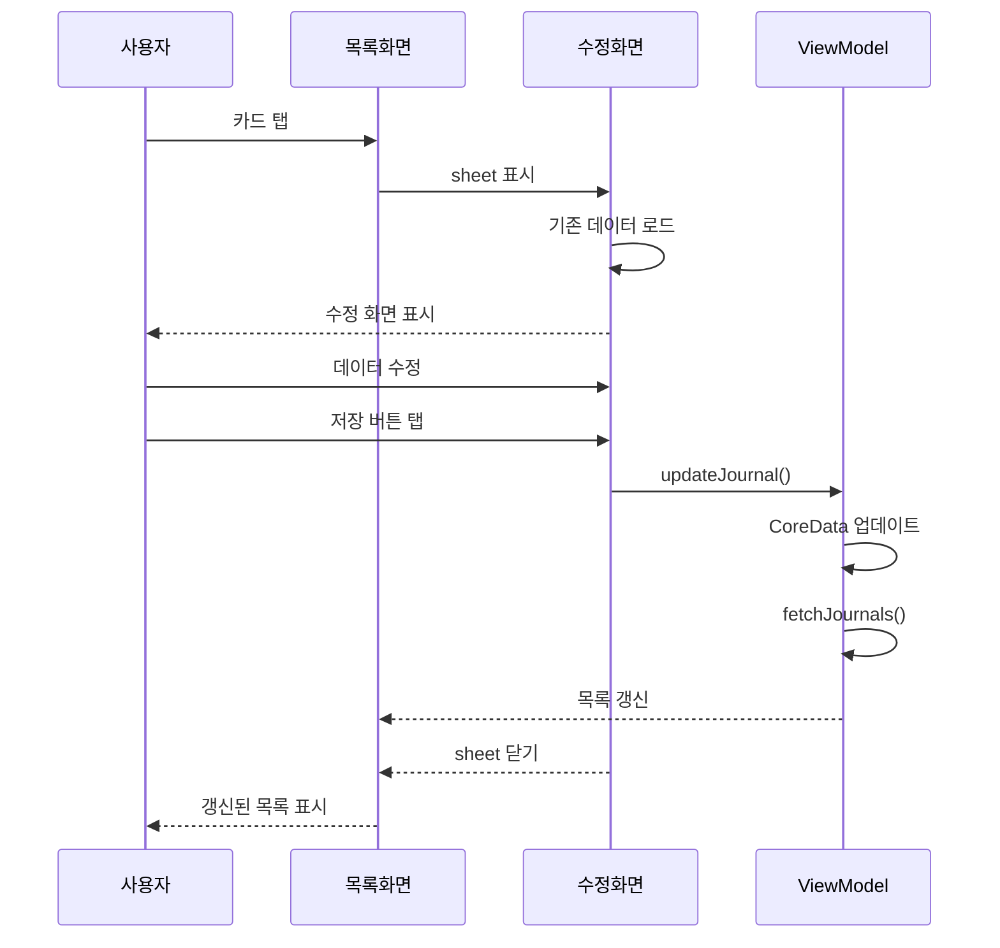
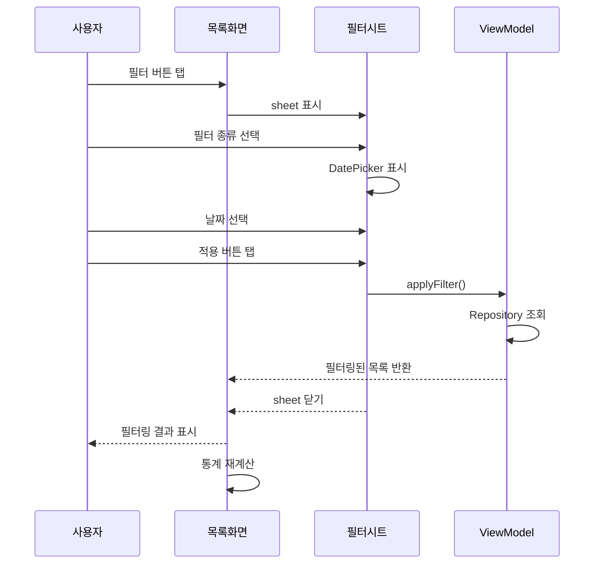
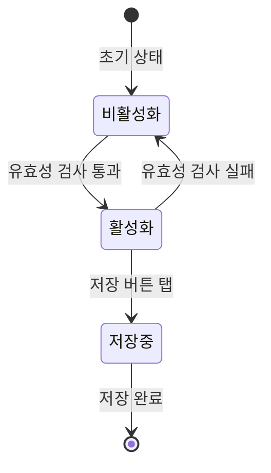

# 매매 일지 화면 설계서

## 1. 개요

### 1.1 목적
매매 일지 개선 사항의 UI/UX 설계를 상세하게 정의합니다.

### 1.2 설계 범위
- 매매 일지 목록 화면 (필터링 기능 추가)
- 매매 일지 작성/수정 화면 (저장 버튼 개선)
- 통계 섹션 (승률 제거)

## 2. 화면 구조

### 2.1 매매 일지 목록 화면 (TradingJournalListView)

#### 레이아웃
```
┌─────────────────────────────────────────────┐
│ 매매 일지             [필터] [+]            │ ← NavigationBar
├─────────────────────────────────────────────┤
│                                             │
│  ┌─────────────────────────────────────┐   │
│  │ 통계 섹션 (TradingJournalStatsView) │   │
│  │                                     │   │
│  │ ┌───────┐ ┌───────┐ ┌───────┐     │   │
│  │ │총매매 │ │ 매수  │ │ 매도  │     │   │
│  │ │ 10건  │ │ 6건   │ │ 4건   │     │   │
│  │ └───────┘ └───────┘ └───────┘     │   │
│  │                                     │   │
│  │ ┌─────────────┐                    │   │
│  │ │실현 손익     │                    │   │
│  │ │+1,250,000원 │                    │   │ ← 승률 제거
│  │ └─────────────┘                    │   │
│  └─────────────────────────────────────┘   │
│                                             │
│  매매 기록                                  │ ← Section Header
│  ┌─────────────────────────────────────┐   │
│  │ 삼성전자              [매수]        │   │
│  │ 2024.12.18           10주 × 75,000원│   │ ← Tap to Edit
│  │ 750,000원                            │   │
│  │ 기술적 반등 포착                    │   │
│  └─────────────────────────────────────┘   │
│  ┌─────────────────────────────────────┐   │
│  │ SK하이닉스            [매도]        │   │
│  │ 2024.12.17           5주 × 145,000원│   │
│  │ 725,000원                            │   │
│  └─────────────────────────────────────┘   │
│                                             │
└─────────────────────────────────────────────┘
```

#### 필터 시트 (FilterSheetView)
```
┌─────────────────────────────────────────────┐
│ 필터 선택                           [닫기]  │
├─────────────────────────────────────────────┤
│                                             │
│  필터 종류                                  │
│  ┌─────────────────────────────────────┐   │
│  │ ○ 전체                              │   │
│  │ ○ 일별                              │   │
│  │ ○ 월별                              │   │
│  │ ○ 년도별                            │   │
│  └─────────────────────────────────────┘   │
│                                             │
│  [선택된 필터에 따른 DatePicker 표시]      │
│                                             │
│  ┌─────────────────────────────────────┐   │
│  │       [적용]                         │   │
│  └─────────────────────────────────────┘   │
│                                             │
└─────────────────────────────────────────────┘
```

#### UI 컴포넌트

##### NavigationBar
- **Title**: "매매 일지" (고정)
- **Leading**: 없음
- **Trailing**:
  - 필터 버튼: `Button(Image(systemName: "line.3.horizontal.decrease.circle"))`
  - 추가 버튼: `Button(Image(systemName: "plus"))`

##### 통계 섹션 (TradingJournalStatsView)
**변경사항**: 승률 카드 제거

```swift
// 기존 레이아웃 (2x2 그리드)
HStack {
    StatCard("총 매매", "10건", .blue)
    StatCard("매수", "6건", .green)
    StatCard("매도", "4건", .red)
}
HStack {
    StatCard("실현 손익", "+1,250,000원", .green)
    StatCard("승률", "75.0%", .orange)  // ← 제거
}

// 개선 레이아웃 (1행 3개 + 1행 1개)
VStack(spacing: 12) {
    HStack(spacing: 16) {
        StatCard("총 매매", "10건", .blue)
        StatCard("매수", "6건", .green)
        StatCard("매도", "4건", .red)
    }

    HStack(spacing: 16) {
        StatCard("실현 손익", "+1,250,000원", .green)
            .frame(maxWidth: .infinity)
    }
}
```

##### 매매 기록 카드 (TradingJournalCardView)
**변경사항**: 탭 제스처 추가

```swift
VStack(alignment: .leading, spacing: 8) {
    // 기존 레이아웃 유지
}
.padding(.vertical, 4)
.contentShape(Rectangle())  // 전체 영역 탭 가능
.onTapGesture {
    // 수정 화면 표시
    selectedJournal = journal
    showingEditJournal = true
}
```

**인터랙션**:
- **Tap**: 수정 화면 표시
- **Swipe Left**: 삭제 버튼 표시 ("삭제" 한글)

### 2.2 매매 일지 작성/수정 화면 (AddTradingJournalView)

#### 레이아웃
```
┌─────────────────────────────────────────────┐
│ [X] 매매 일지 작성                          │ ← NavigationBar (간소화)
├─────────────────────────────────────────────┤
│                                             │
│  매매 유형                                  │
│  ┌─────────────┬─────────────┐            │
│  │   매수      │   매도      │  (Segmented)│
│  └─────────────┴─────────────┘            │
│                                             │
│  매매일                                     │
│  ┌─────────────────────────────────────┐   │
│  │  2024년 12월 18일          ▼       │   │
│  └─────────────────────────────────────┘   │
│                                             │
│  종목명                                     │
│  ┌─────────────────────────────────────┐   │
│  │  삼성전자                            │   │
│  └─────────────────────────────────────┘   │
│                                             │
│  수량                                       │
│  ┌─────────────────────────────────────┐   │
│  │  10                                  │   │
│  └─────────────────────────────────────┘   │
│                                             │
│  단가                                       │
│  ┌─────────────────────────────────────┐   │
│  │  75,000                              │   │
│  └─────────────────────────────────────┘   │
│                                             │
│  총액                                       │
│  ┌─────────────────────────────────────┐   │
│  │  750,000원                           │   │
│  └─────────────────────────────────────┘   │
│                                             │
│  매매 이유 (선택)                          │
│  ┌─────────────────────────────────────┐   │
│  │  기술적 반등 포착                   │   │
│  │                                     │   │
│  └─────────────────────────────────────┘   │
│                                             │
├─────────────────────────────────────────────┤
│  ┌─────────────────────────────────────┐   │
│  │            [저장]                    │   │ ← 항상 표시
│  └─────────────────────────────────────┘   │
│  ┌─────────────────────────────────────┐   │
│  │            완료                      │   │ ← 포커스 시만 표시
│  └─────────────────────────────────────┘   │
└─────────────────────────────────────────────┘
```

#### UI 컴포넌트 변경사항

##### NavigationBar
```swift
// 기존
.navigationTitle(editingJournal == nil ? "매매 일지 작성" : "매매 일지 수정")
.navigationBarTitleDisplayMode(.inline)

// 개선 (간소화 옵션)
.navigationTitle("")  // 타이틀 제거 또는
.navigationBarTitleDisplayMode(.inline)  // 유지
```

##### 저장 버튼 영역
**변경사항**: 포커스와 무관하게 항상 표시

```swift
// 기존
.safeAreaInset(edge: .bottom) {
    VStack(spacing: 12) {
        Button("저장") { saveJournal() }
            .disabled(!isValidInput)
        Button("완료") { focusedField = nil }
    }
    .offset(y: focusedField != nil ? 0 : 200)  // 포커스 시만 표시
    .opacity(focusedField != nil ? 1 : 0)
}

// 개선
.safeAreaInset(edge: .bottom) {
    VStack(spacing: 12) {
        // 저장 버튼: 항상 표시
        Button("저장") { saveJournal() }
            .disabled(!isValidInput)
            .opacity(isValidInput ? 1.0 : 0.5)

        // 완료 버튼: 포커스 시만 표시
        if focusedField != nil {
            Button("완료") { focusedField = nil }
        }
    }
    // 애니메이션 제거 또는 저장 버튼만 항상 표시
}
```

### 2.3 필터 선택 화면

#### 일별 필터
```
┌─────────────────────────────────────────────┐
│ 일별 필터                           [닫기]  │
├─────────────────────────────────────────────┤
│                                             │
│  ┌─────────────────────────────────────┐   │
│  │        2024년 12월                   │   │
│  │  일  월  화  수  목  금  토          │   │
│  │              1   2   3   4   5      │   │
│  │  6   7   8   9  10  11  12          │   │
│  │ 13  14  15  16  17 [18] 19          │   │ ← 선택
│  │ 20  21  22  23  24  25  26          │   │
│  │ 27  28  29  30  31                  │   │
│  └─────────────────────────────────────┘   │
│                                             │
│  ┌─────────────────────────────────────┐   │
│  │            [적용]                    │   │
│  └─────────────────────────────────────┘   │
│                                             │
└─────────────────────────────────────────────┘
```

```swift
DatePicker(
    "날짜 선택",
    selection: $selectedDate,
    displayedComponents: .date
)
.datePickerStyle(.graphical)
.labelsHidden()
```

#### 월별 필터
```
┌─────────────────────────────────────────────┐
│ 월별 필터                           [닫기]  │
├─────────────────────────────────────────────┤
│                                             │
│  ┌─────────────────────────────────────┐   │
│  │          [2024년]                    │   │
│  │          [12월]                      │   │ ← Wheel Picker
│  └─────────────────────────────────────┘   │
│                                             │
│  ┌─────────────────────────────────────┐   │
│  │            [적용]                    │   │
│  └─────────────────────────────────────┘   │
│                                             │
└─────────────────────────────────────────────┘
```

```swift
DatePicker(
    "월 선택",
    selection: $selectedMonth,
    displayedComponents: .date
)
.datePickerStyle(.wheel)
.labelsHidden()
```

#### 년도별 필터
```
┌─────────────────────────────────────────────┐
│ 년도별 필터                         [닫기]  │
├─────────────────────────────────────────────┤
│                                             │
│  연도 선택                                  │
│  ┌─────────────────────────────────────┐   │
│  │  2024                        ▼      │   │
│  │  2023                                │   │
│  │  2022                                │   │
│  │  ...                                 │   │
│  └─────────────────────────────────────┘   │
│                                             │
│  ┌─────────────────────────────────────┐   │
│  │            [적용]                    │   │
│  └─────────────────────────────────────┘   │
│                                             │
└─────────────────────────────────────────────┘
```

```swift
Picker("연도 선택", selection: $selectedYear) {
    ForEach(yearRange, id: \.self) { year in
        Text("\(year)년").tag(year)
    }
}
.pickerStyle(.menu)
```

## 3. 인터랙션 정의

### 3.1 매매 기록 수정 플로우



### 3.2 필터 적용 플로우



### 3.3 저장 버튼 상태 변화



**유효성 검사 조건**:
- 종목명: 공백 제거 후 비어있지 않음
- 수량: 1 이상의 정수
- 가격: 0보다 큰 숫자
- 매매일: 미래 날짜 아님

## 4. 스타일 가이드

### 4.1 색상 정의

```swift
// 매매 유형 색상
let buyColor = Color.green
let sellColor = Color.red

// 통계 카드 색상
let totalTradeColor = Color.blue
let buyTradeColor = Color.green
let sellTradeColor = Color.red
let profitColor = Color.green  // 수익
let lossColor = Color.red      // 손실

// 버튼 색상
let primaryButtonColor = Color.accentColor
let disabledButtonColor = Color.accentColor.opacity(0.5)
```

### 4.2 타이포그래피

```swift
// NavigationBar Title
.font(.title2)
.fontWeight(.bold)

// Section Header
.font(.headline)

// 카드 종목명
.font(.headline)

// 카드 날짜/수량
.font(.caption)
.foregroundColor(.secondary)

// 카드 총액
.font(.title3)
.fontWeight(.bold)

// 통계 타이틀
.font(.caption)
.foregroundColor(.secondary)

// 통계 값
.font(.system(size: 16, weight: .bold))

// 버튼 텍스트
.font(.headline)
```

### 4.3 스페이싱

```swift
// 카드 간 간격
.listRowSpacing(8)

// 통계 카드 간 간격
HStack(spacing: 16)

// 통계 섹션 세로 간격
VStack(spacing: 12)

// 입력 필드 간 간격
VStack(spacing: 24)

// 버튼 간 간격
VStack(spacing: 12)
```

### 4.4 코너 라디우스

```swift
// 카드
.cornerRadius(8)

// 입력 필드
.clipShape(RoundedRectangle(cornerRadius: 8))

// 버튼
.clipShape(RoundedRectangle(cornerRadius: 12))

// 매매 유형 배지
.cornerRadius(8)
```

## 5. 다크 모드 대응

### 5.1 색상 자동 적용
- System Background Colors 사용
  - `Color(.systemBackground)`
  - `Color(.secondarySystemBackground)`
- System Label Colors 사용
  - `.foregroundColor(.primary)`
  - `.foregroundColor(.secondary)`

### 5.2 Accent Color
- 시스템 Accent Color 활용
- 라이트 모드: 파란색 계열
- 다크 모드: 자동 조정

## 6. 접근성

### 6.1 VoiceOver 지원

```swift
// 매매 기록 카드
.accessibilityLabel("\(journal.stockName), \(journal.tradeType.rawValue), \(journal.quantity)주, \(formattedPrice(journal.totalAmount))")
.accessibilityHint("탭하여 수정")

// 필터 버튼
.accessibilityLabel("필터")
.accessibilityHint("매매 기록 필터링")

// 삭제 액션
.accessibilityLabel("삭제")
.accessibilityHint("\(journal.stockName) 매매 기록 삭제")
```

### 6.2 Dynamic Type
- 모든 텍스트 Dynamic Type 지원
- `.font(.headline)` 등 시스템 폰트 사용
- 커스텀 폰트 크기는 `@ScaledMetric` 사용

### 6.3 색상 대비
- WCAG AA 준수
- 텍스트 대 배경: 4.5:1 이상
- 대형 텍스트: 3:1 이상

## 7. 애니메이션

### 7.1 화면 전환
```swift
// Sheet 표시
.sheet(isPresented: $showingEditJournal) {
    AddTradingJournalView(...)
}

// 기본 애니메이션 사용 (슬라이드 업)
```

### 7.2 목록 갱신
```swift
// 자동 애니메이션
.animation(.default, value: viewModel.journals)
```

### 7.3 버튼 상태 변화
```swift
// 투명도 애니메이션
.opacity(isValidInput ? 1.0 : 0.5)
.animation(.easeInOut(duration: 0.2), value: isValidInput)
```

### 7.4 필터 적용
```swift
// 목록 페이드 인
.transition(.opacity)
```

## 8. 성능 최적화

### 8.1 목록 렌더링
- LazyVStack 사용 (List는 자동 최적화)
- 페이징 지원 (20개 단위)

### 8.2 필터링
- Repository 레벨에서 필터링 (메모리 효율)
- Core Data Predicate 활용

### 8.3 통계 계산
- Computed Property 사용
- 필요 시 캐싱 고려

## 9. 구현 우선순위

### Phase 1
1. 승률 통계 제거
2. 매매 기록 탭 → 수정 화면
3. 저장 버튼 항상 표시

### Phase 2
4. 필터 UI 구현 (일별/월별/년도별)
5. 필터링 로직 연동

### Phase 3
6. 삭제 버튼 한글화
7. 타이틀 간소화

## 10. 테스트 시나리오

### UI 테스트
- [ ] 매매 기록 카드 탭 시 수정 화면 표시
- [ ] 수정 화면에 기존 데이터 로드
- [ ] 필터 버튼 탭 시 필터 시트 표시
- [ ] 필터 적용 시 목록 갱신
- [ ] 저장 버튼 유효성에 따라 활성화/비활성화
- [ ] 스와이프 삭제 시 "삭제" 한글 표시
- [ ] 통계 섹션에 승률 미표시

### 접근성 테스트
- [ ] VoiceOver로 모든 요소 탐색 가능
- [ ] Dynamic Type 적용 시 레이아웃 유지
- [ ] 다크 모드 전환 시 색상 정상 표시
