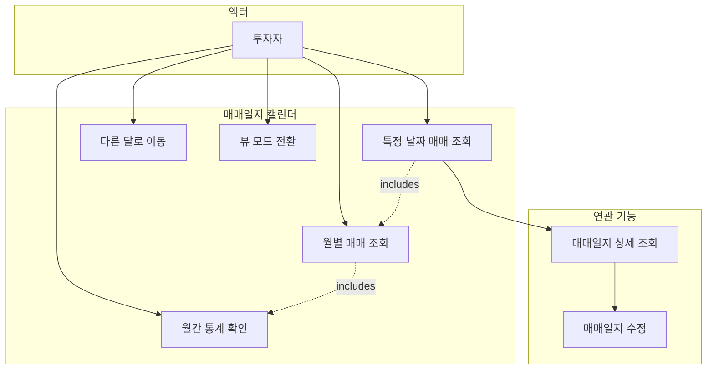
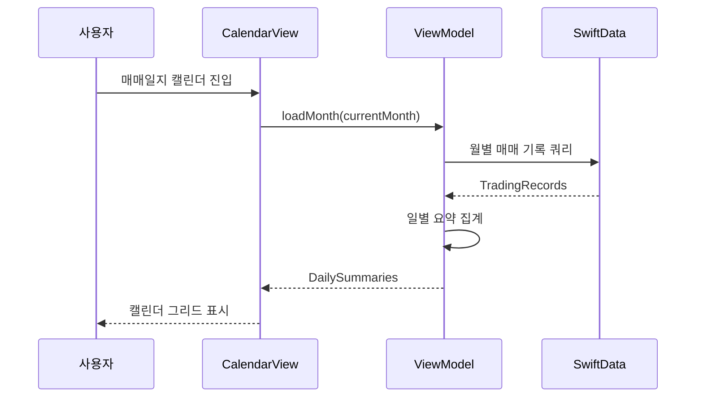
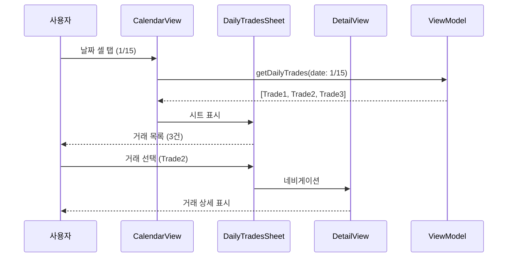
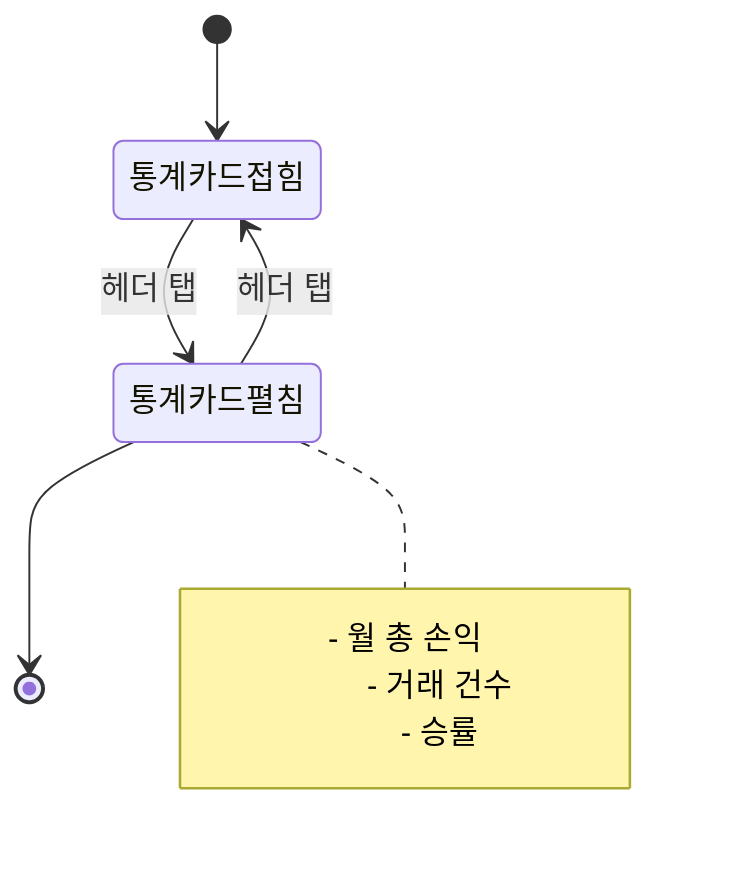
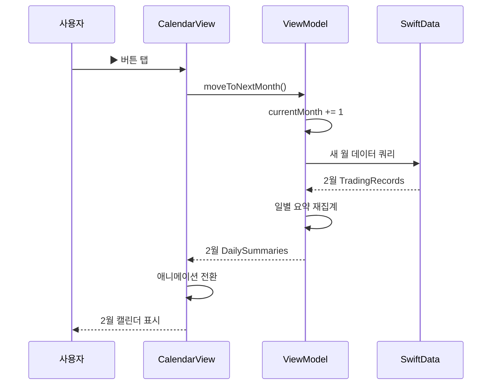
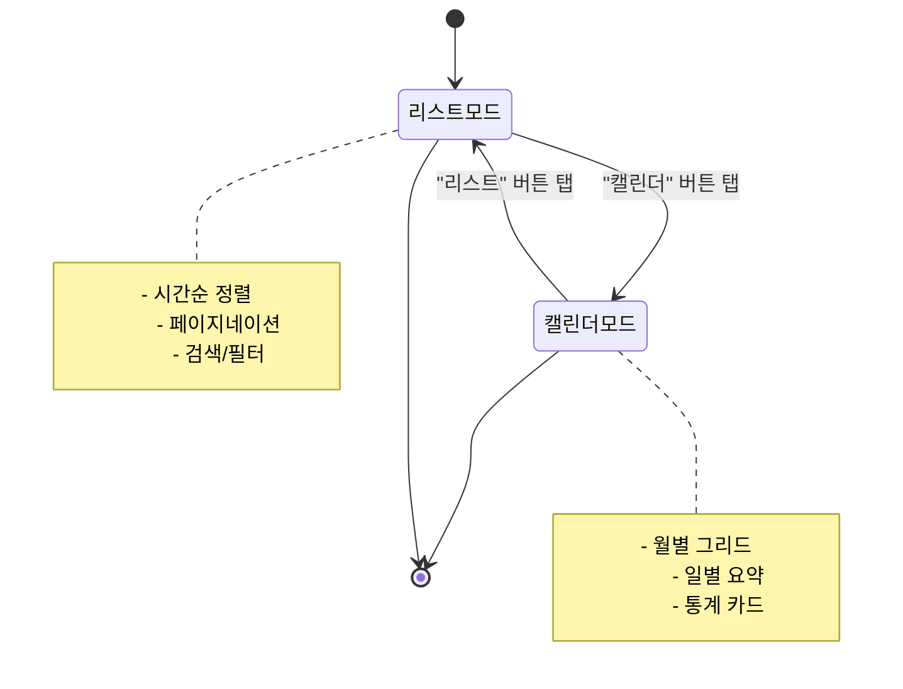
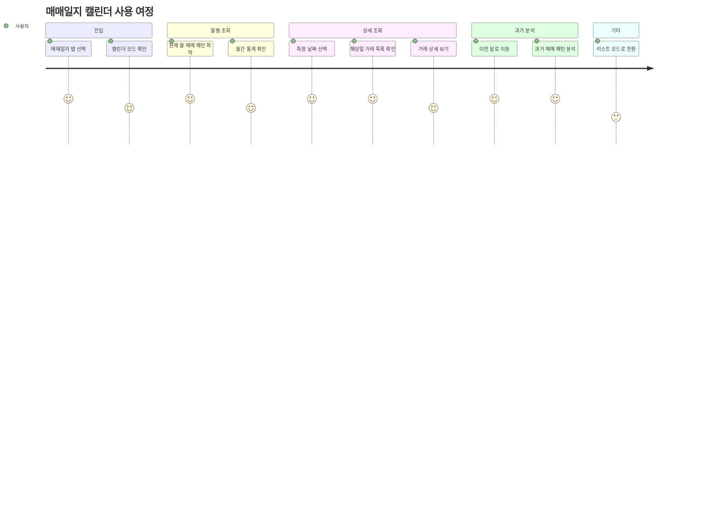

# 매매일지 캘린더 유스케이스

## 문서 정보

**버전:** v1.0
**최종 수정일:** 2024-12-24
**작성자:** Claude Code

## 변경 이력

### v1.0 (2024-12-24)
- 초기 작성
- 캘린더 주요 유스케이스 정의 (월별 조회, 특정 날짜 조회, 월간 통계, 월 이동, 뷰 전환)
- 시퀀스 다이어그램 및 사용자 여정 작성
- 예외 시나리오 및 통합 테스트 시나리오 정의

## 1. 유스케이스 다이어그램



## 2. 주요 유스케이스 상세

### 2.1 UC1: 월별 매매 조회

**목표**: 특정 월의 모든 매매 활동을 캘린더 형태로 확인

**사전 조건**:
- 매매일지 탭 진입
- 캘린더 모드 활성화

**기본 흐름**:
1. 사용자가 매매일지 탭 선택
2. 시스템이 현재 월 캘린더 표시
3. 시스템이 각 날짜에 매매 요약 정보 표시
   - 거래 건수 인디케이터 (최대 3개 점)
   - 일일 손익 금액
   - 수익/손실 색상 구분
4. 사용자가 월별 전체 매매 패턴 파악

**후행 조건**:
- 월별 매매 현황 시각화 완료
- 특정 날짜 선택 가능 상태

**시퀀스 다이어그램**:


---

### 2.2 UC2: 특정 날짜 매매 조회

**목표**: 선택한 날짜의 모든 매매 기록 상세 확인

**사전 조건**:
- 월별 캘린더 표시 중
- 매매가 있는 날짜 존재

**기본 흐름**:
1. 사용자가 매매가 있는 날짜 셀 탭
2. 시스템이 해당일 매매일지 목록 시트 표시
3. 시스템이 거래 목록을 시간 순으로 정렬하여 표시
4. 사용자가 특정 거래 선택
5. 시스템이 거래 상세 화면 표시

**대체 흐름**:
- 2a. 매매가 없는 날짜 탭 시:
  - 시스템이 반응하지 않음 또는 "거래 없음" 토스트 표시

**후행 조건**:
- 해당일 거래 목록 표시
- 상세 조회 또는 수정 가능

**시퀀스 다이어그램**:


---

### 2.3 UC3: 월간 통계 확인

**목표**: 한 달 동안의 매매 성과 요약 확인

**사전 조건**:
- 월별 캘린더 표시 중
- 통계 카드 펼침 상태

**기본 흐름**:
1. 사용자가 통계 카드 영역 확인
2. 시스템이 다음 정보 표시:
   - 월 총 손익 금액 및 색상
   - 월 총 거래 건수
   - 승률 (수익 거래 수 / 전체 거래 수)
3. 사용자가 월간 성과 파악

**대체 흐름**:
- 1a. 통계 카드가 접힌 상태:
  - 사용자가 카드 헤더 탭
  - 시스템이 애니메이션으로 카드 펼침

**후행 조건**:
- 월간 성과 지표 확인 완료

**상태 다이어그램**:


---

### 2.4 UC4: 다른 달로 이동

**목표**: 과거 또는 미래 월의 매매 기록 조회

**사전 조건**:
- 캘린더 모드 활성화

**기본 흐름**:
1. 사용자가 "◀" 또는 "▶" 버튼 탭
2. 시스템이 이전/다음 달로 애니메이션 전환
3. 시스템이 새 월의 매매 데이터 로드
4. 시스템이 캘린더 및 통계 업데이트

**대체 흐름**:
- 1a. 스와이프 제스처 사용 (선택 사항):
  - 사용자가 좌/우 스와이프
  - 시스템이 월 이동 (좌: 다음달, 우: 이전달)

**후행 조건**:
- 새 월의 캘린더 표시
- 통계 정보 갱신

**시퀀스 다이어그램**:


---

### 2.5 UC5: 뷰 모드 전환

**목표**: 캘린더 ↔ 리스트 뷰 간 전환

**사전 조건**:
- 매매일지 탭 진입

**기본 흐름**:
1. 사용자가 "리스트" 또는 "캘린더" 버튼 탭
2. 시스템이 뷰 모드 전환
3. 시스템이 동일한 월/기간 데이터를 다른 형식으로 표시

**후행 조건**:
- 새 뷰 모드 활성화
- 필터 및 정렬 옵션 유지

**상태 다이어그램**:


---

## 3. 전체 사용자 여정 (User Journey)



## 4. 예외 시나리오

### 4.1 데이터 없음
**상황**: 선택한 월에 매매 기록이 전혀 없음

**처리**:
1. 캘린더는 정상 표시
2. 모든 날짜 셀은 빈 상태
3. 통계 카드: "거래 없음" 또는 "0원 / 0건 / 0%" 표시

### 4.2 대량 거래
**상황**: 하루에 10건 이상의 거래 발생

**처리**:
1. 인디케이터는 최대 3개만 표시 (4건 이상도 3개)
2. 손익 금액은 합산하여 표시
3. 시트에서는 전체 목록 페이지네이션 (10개씩)

### 4.3 미래 날짜
**상황**: 사용자가 미래 날짜 선택 시도

**처리**:
1. 탭 제스처 무시
2. 시각적 피드백 없음
3. (선택) 토스트 메시지: "미래 날짜는 선택할 수 없습니다"

## 5. 비기능 요구사항 유스케이스

### 5.1 성능
**시나리오**: 100건 이상의 월간 거래 로드

**기대 결과**:
- 초기 로드: 1초 이내
- 월 전환: 0.5초 이내
- 날짜 선택 응답: 즉시 (0.1초)

### 5.2 접근성
**시나리오**: VoiceOver 사용자가 캘린더 조회

**기대 결과**:
- 각 날짜 셀: "15일, 3건 거래, 플러스 12만원" 읽기
- 월 이동 버튼: "이전 달로 이동" 힌트 제공
- 통계 카드: 각 지표 개별 읽기

### 5.3 오프라인
**시나리오**: 네트워크 없이 캘린더 조회

**기대 결과**:
- 로컬 SwiftData만 사용하므로 정상 동작
- 실시간 시세 연동 기능만 제한 (해당되지 않음)

## 6. 통합 테스트 시나리오

### 시나리오 1: 첫 사용자
```
Given: 매매일지 데이터가 전혀 없는 사용자
When: 캘린더 모드 진입
Then:
  - 현재 월 캘린더 표시
  - 모든 날짜 셀 빈 상태
  - 통계: "0원 / 0건 / 0%"
```

### 시나리오 2: 활발한 트레이더
```
Given: 한 달에 50건 이상 거래한 사용자
When: 캘린더 조회
Then:
  - 대부분의 날짜에 인디케이터 표시
  - 통계 카드에 정확한 집계 표시
  - 특정 날짜 탭 시 시트에 해당일 전체 거래 표시
```

### 시나리오 3: 과거 데이터 조회
```
Given: 2024년 1월부터 거래한 사용자
When: 2025년 1월에 2024년 1월 조회
Then:
  - "◀" 버튼 12회 탭으로 이동
  - 2024년 1월 데이터 정상 로드
  - 통계 정확히 표시
```

## 7. 유스케이스 우선순위

| 우선순위 | 유스케이스 | Phase |
|---------|-----------|-------|
| P0 | UC1: 월별 매매 조회 | MVP |
| P0 | UC2: 특정 날짜 매매 조회 | MVP |
| P0 | UC4: 다른 달로 이동 | MVP |
| P1 | UC3: 월간 통계 확인 | Phase 2 |
| P1 | UC5: 뷰 모드 전환 | Phase 2 |
| P2 | 스와이프 월 이동 | Phase 3 |
| P2 | 주간 뷰 | Phase 3 |
