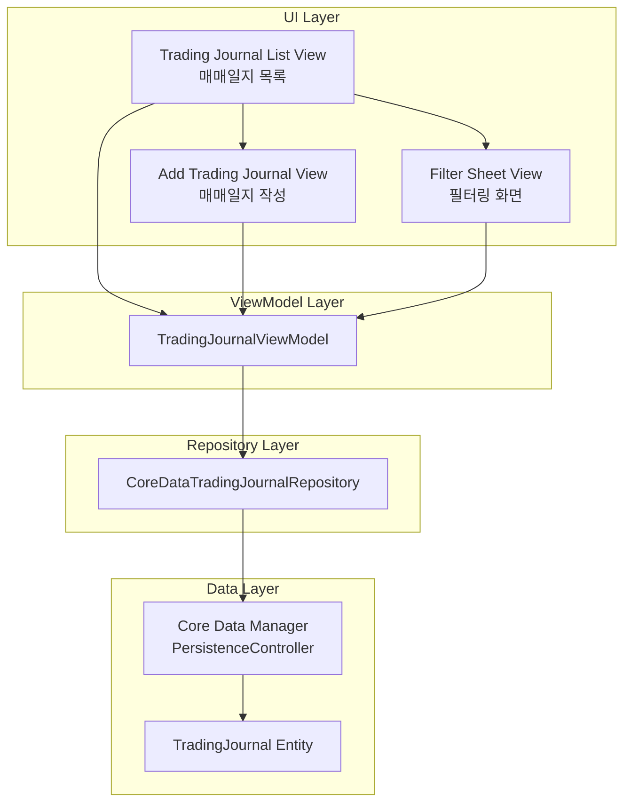
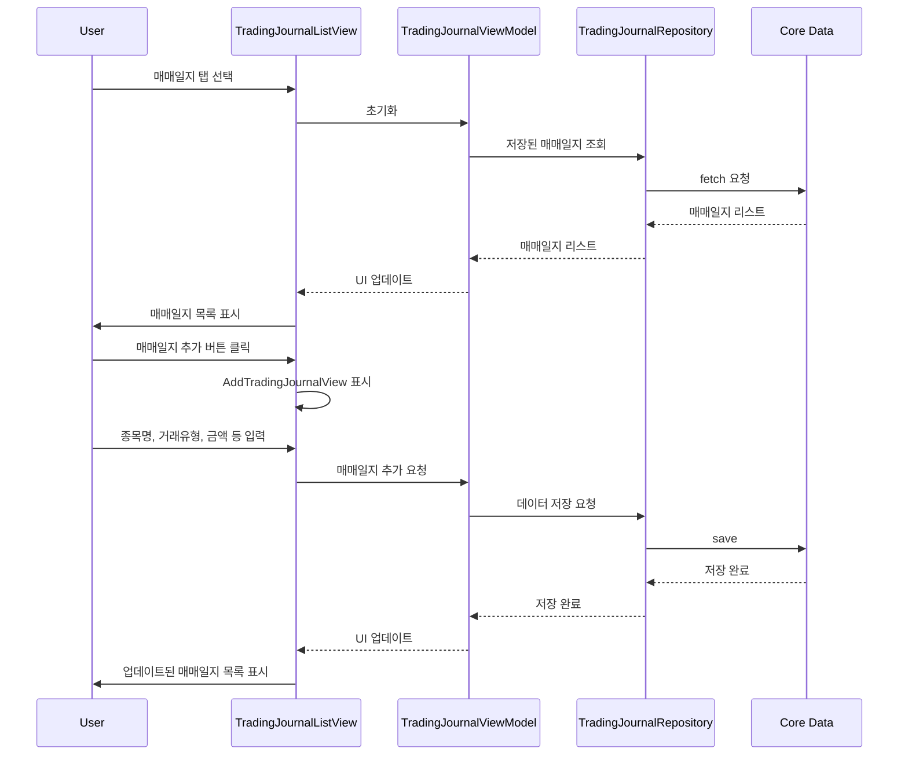
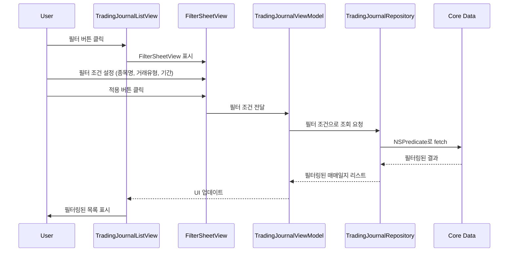

# 매매 일지 기능 정의서

## 1. 개요

### 1.1 목적
투자자가 자신의 매매 기록을 체계적으로 관리하고, 매매 패턴과 수익률을 분석하여 투자 실력을 향상시킬 수 있도록 지원합니다.

### 1.2 핵심 가치
- **기록의 습관화**: 간편한 입력으로 매매 기록 습관 형성
- **자기 반성**: 매매 이유를 기록하여 감정적 매매 방지
- **데이터 기반 개선**: 통계를 통해 자신의 투자 패턴 파악

## 2. 기능 요구사항

### 2.1 매매 일지 작성

#### 2.1.1 필수 입력 항목
- **매매 유형**: 매수 / 매도 (선택)
- **날짜**: 매매일 (DatePicker)
- **종목명**: 텍스트 입력 (최대 50자)
- **수량**: 숫자 입력 (양의 정수)
- **가격**: 단가 (원 단위)

#### 2.1.2 자동 계산 항목
- **총액**: 수량 × 가격
- **손익**: 매도 시 자동 계산 (매도가 - 매수가)
- **수익률**: (손익 / 매수가) × 100

#### 2.1.3 선택 입력 항목
- **매매 이유/전략**: 멀티라인 텍스트 (최대 1000자)
  - 왜 샀는지/팔았는지
  - 어떤 전략을 사용했는지
  - 시장 상황 분석

#### 2.1.4 검증 규칙
- 종목명: 공백 불가, 특수문자 제한
- 수량: 1 이상의 정수
- 가격: 0보다 큰 숫자
- 날짜: 미래 날짜 불가

### 2.2 매매 일지 조회

#### 2.2.1 목록 화면
- **정렬**: 최신순 (날짜 기준 내림차순)
- **표시 정보**:
  - 날짜
  - 종목명
  - 매매 유형 (매수/매도 배지)
  - 수량 × 단가
  - 총액
  - 손익 (매도 건만, 색상 구분)

#### 2.2.2 필터링
- **날짜 범위**: 시작일 ~ 종료일
- **종목명**: 특정 종목만 조회
- **매매 유형**: 매수만 / 매도만 / 전체

#### 2.2.3 페이징
- 20개 단위로 로드
- 스크롤 시 추가 로드

### 2.3 매매 일지 수정/삭제

#### 2.3.1 수정
- 작성한 모든 항목 수정 가능
- 수정 이력 추적 (수정일시 기록)

#### 2.3.2 삭제
- 스와이프로 삭제
- 삭제 전 확인 알림
- 삭제 후 되돌리기 불가

### 2.4 통계 및 분석

#### 2.4.1 기본 통계
- **총 매매 횟수**: 매수 N건, 매도 N건
- **실현 손익**: 매도 완료 건의 총 손익
- **평균 수익률**: 실현 손익 / 총 매수금액 × 100
- **승률**: 수익 건수 / 전체 매도 건수 × 100

#### 2.4.2 종목별 통계
- 종목별 매수/매도 횟수
- 종목별 평균 수익률
- 가장 많이 거래한 종목 TOP 5

#### 2.4.3 기간별 통계
- 월별 손익 차트 (막대 그래프)
- 월별 매매 횟수

## 3. 데이터 모델

### 3.1 TradingJournal Entity

```swift
struct TradingJournalEntity: Identifiable {
    let id: UUID
    var tradeType: TradeType          // 매수/매도
    var tradeDate: Date                // 매매일
    var stockName: String              // 종목명
    var quantity: Int                  // 수량
    var price: Double                  // 단가
    var reason: String                 // 매매 이유
    var createdAt: Date                // 작성일
    var updatedAt: Date                // 수정일

    // 계산 속성
    var totalAmount: Double {          // 총액
        Double(quantity) * price
    }
}

enum TradeType: String {
    case buy = "매수"
    case sell = "매도"
}
```

### 3.2 CoreData 스키마

```
Entity: TradingJournal
- id: UUID (Primary Key)
- tradeType: String (매수/매도)
- tradeDate: Date
- stockName: String
- quantity: Int32
- price: Double
- reason: String (Optional)
- createdAt: Date
- updatedAt: Date

Index: tradeDate (내림차순)
Index: stockName (오름차순)
```

## 4. 화면 구성

### 4.1 앱 구성도



### 4.2 데이터 흐름도

#### 매매일지 CRUD 흐름



#### 필터링 흐름



### 4.3 화면 흐름

```
메인 대시보드
    ↓
매매 일지 탭
    ├─→ 일지 목록 (필터링)
    │   ├─→ 일지 상세/수정
    │   └─→ 일지 삭제
    ├─→ 일지 작성 (+버튼)
    └─→ 통계 보기
```

### 4.4 네비게이션
- **탭 바**: 포트폴리오 / 매매 일지
- **일지 목록**: 필터 버튼, + 버튼 (우측 상단)
- **일지 작성/수정**: 모달 형태

## 5. 비기능 요구사항

### 5.1 성능
- 목록 로딩: 1초 이내
- 필터 적용: 즉시 반영 (0.3초 이내)
- 데이터 저장: 0.5초 이내

### 5.2 보안
- 사용자 입력 검증 (SQL Injection, XSS 방지)
- 매매 이유 텍스트 길이 제한 (1000자)

### 5.3 접근성
- VoiceOver 지원
- Dynamic Type 지원
- 색상 대비 WCAG AA 준수

## 6. 개발 우선순위

### Phase 1 (MVP)
- [ ] 매매 일지 작성 (기본 정보)
- [ ] 매매 일지 목록 조회
- [ ] 매매 일지 수정/삭제
- [ ] 기본 통계 (총 매매 횟수, 실현 손익)

### Phase 2
- [ ] 필터링 기능
- [ ] 종목별/기간별 통계
- [ ] 손익 자동 계산 (매수-매도 매칭)

### Phase 3
- [ ] 차트 시각화
- [ ] CSV 내보내기
- [ ] 검색 기능

## 7. 성공 지표

- **사용률**: 주 1회 이상 매매 일지 작성
- **완성도**: 매매 이유 작성률 80% 이상
- **만족도**: 통계 화면 조회율 50% 이상

## 8. 폴더 구조 (매매일지 관련)

```
StockFolio/
├── Models/
│   └── TradingJournalEntity.swift       # Core Data Entity
├── Views/
│   ├── TradingJournalListView.swift     # 매매일지 목록
│   ├── AddTradingJournalView.swift      # 매매일지 작성
│   └── FilterSheetView.swift            # 필터링 화면
├── ViewModels/
│   └── TradingJournalViewModel.swift
├── Protocols/
│   └── TradingJournalRepositoryProtocol.swift
└── Services/
    └── CoreDataTradingJournalRepository.swift
```

## 9. 제약사항

- 오프라인 전용 (서버 동기화 없음)
- 이미지 첨부 불가 (Phase 1)
- 매수-매도 자동 매칭 없음 (Phase 1, 수동 계산)
