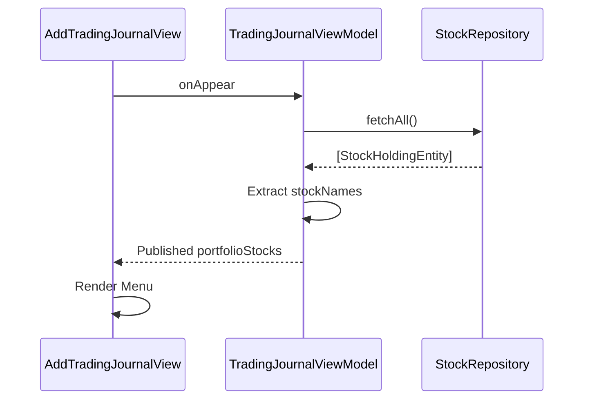
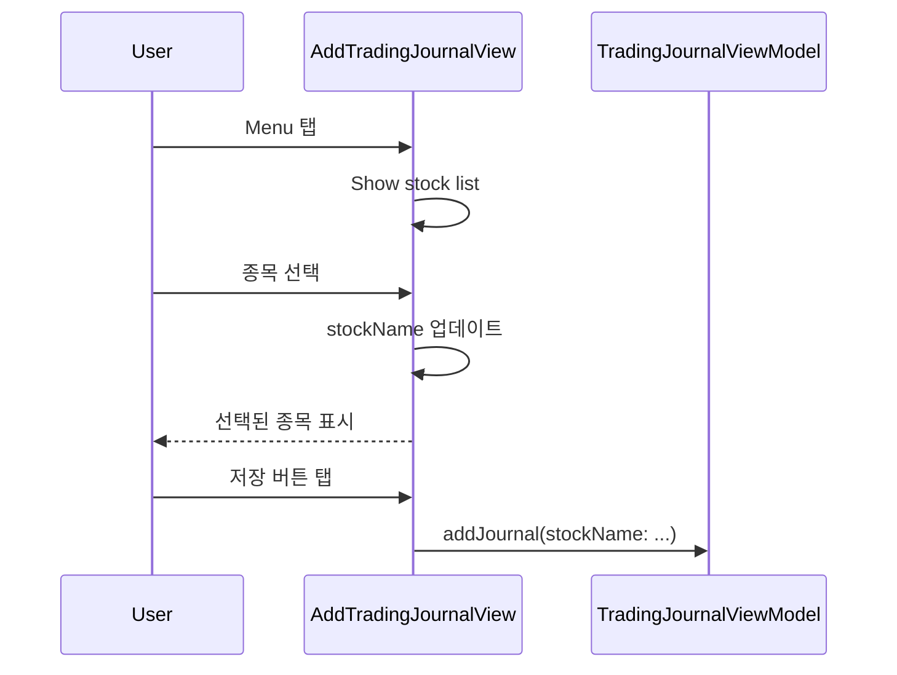

# 포트폴리오 종목 선택 기능 정의서

## 문서 정보

**버전:** v1.0
**최종 수정일:** 2024-12-24
**작성자:** Claude Code

## 변경 이력

### v1.0 (2024-12-24)
- 초기 작성
- 포트폴리오 종목 데이터 조회 및 선택 UI 요구사항 정의
- MVVM 아키텍처 설계 및 의존성 주입(DIP) 구조 수립
- SOLID 원칙 적용 및 테스트 시나리오 작성

## 1. 개요

### 1.1 목적
매매 기록 작성 시 포트폴리오에 등록된 종목을 선택할 수 있도록 개선하여, 데이터 일관성을 높이고 사용자 편의성을 향상시킵니다.

### 1.2 핵심 가치
- **데이터 일관성**: 포트폴리오와 매매 기록의 종목명 통일
- **사용자 편의성**: 직접 입력 대신 선택으로 입력 오류 방지
- **데이터 연계**: 포트폴리오와 매매 기록의 자연스러운 연동

### 1.3 현재 문제점
- 매매 기록 작성 시 종목명을 직접 입력해야 함
- 포트폴리오에 등록된 종목과 매매 기록의 종목명이 일치하지 않을 수 있음
- 오타 발생 가능성

## 2. 기능 요구사항

### 2.1 포트폴리오 종목 데이터 조회

#### 2.1.1 데이터 소스
- **Repository**: `StockRepositoryProtocol`을 통해 포트폴리오 종목 조회
- **Entity**: `StockHoldingEntity` 사용
- **속성**: 종목명(`stockName`)만 활용

#### 2.1.2 데이터 제공 방식
- TradingJournalViewModel에서 StockRepositoryProtocol 의존성 주입
- ViewModel이 포트폴리오 종목 목록을 Published 속성으로 제공
- View에서 실시간 업데이트된 종목 목록 사용

### 2.2 종목 선택 UI

#### 2.2.1 UI 컴포넌트
**Menu 방식** (추천)
- 장점: 네이티브 iOS UI, 심플하고 직관적
- 컴포넌트: SwiftUI `Menu` + `ForEach`
- 위치: 기존 종목명 TextField를 Menu로 교체

```swift
Menu {
    ForEach(portfolioStocks, id: \.self) { stockName in
        Button(stockName) {
            self.stockName = stockName
        }
    }
} label: {
    HStack {
        Text(stockName.isEmpty ? "종목 선택" : stockName)
            .foregroundColor(stockName.isEmpty ? .secondary : .primary)
        Spacer()
        Image(systemName: "chevron.down")
            .foregroundColor(.secondary)
    }
    .padding()
    .background(Color(.secondarySystemBackground))
    .clipShape(RoundedRectangle(cornerRadius: 8))
}
```

#### 2.2.2 대체안: Picker 방식
```swift
Picker("종목 선택", selection: $stockName) {
    Text("종목 선택").tag("")
    ForEach(portfolioStocks, id: \.self) { stock in
        Text(stock).tag(stock)
    }
}
.pickerStyle(.menu)
```

#### 2.2.3 빈 목록 처리
- 포트폴리오에 등록된 종목이 없는 경우:
  - 안내 메시지 표시: "포트폴리오에 종목을 먼저 등록하세요"
  - 포트폴리오 등록 화면으로 이동하는 버튼 제공 (선택)

### 2.3 데이터 흐름

#### 2.3.1 종목 목록 로드


#### 2.3.2 종목 선택


### 2.4 검증 규칙

#### 2.4.1 입력 검증
- 종목명: 빈 문자열이 아니어야 함
- 기존 검증 로직 유지 (수량, 가격, 날짜)

#### 2.4.2 데이터 정합성
- 선택된 종목은 반드시 포트폴리오에 존재하는 종목이어야 함
- ViewModel에서 자동으로 보장됨 (선택 방식이므로)

## 3. 아키텍처 설계

### 3.1 MVVM 구조

```
┌──────────────────────────────────────────┐
│           AddTradingJournalView          │
│  - Menu(포트폴리오 종목 목록)            │
│  - @State stockName                      │
└──────────────┬───────────────────────────┘
               │ @ObservedObject
               ▼
┌──────────────────────────────────────────┐
│      TradingJournalViewModel             │
│  - @Published portfolioStocks: [String]  │
│  - stockRepository: StockRepositoryProtocol│
│  - fetchPortfolioStocks()                │
└──────────────┬───────────────────────────┘
               │ DIP
               ▼
┌──────────────────────────────────────────┐
│      StockRepositoryProtocol             │
│  - fetchAll() -> [StockHoldingEntity]    │
└──────────────────────────────────────────┘
```

### 3.2 의존성 주입 (DIP)

#### TradingJournalViewModel
```swift
final class TradingJournalViewModel: ObservableObject {
    @Published private(set) var journals: [TradingJournalEntity] = []
    @Published private(set) var portfolioStocks: [String] = []  // 추가

    private let journalRepository: TradingJournalRepositoryProtocol
    private let stockRepository: StockRepositoryProtocol  // 추가

    init(
        journalRepository: TradingJournalRepositoryProtocol = CoreDataTradingJournalRepository(),
        stockRepository: StockRepositoryProtocol = CoreDataStockRepository()  // 추가
    ) {
        self.journalRepository = journalRepository
        self.stockRepository = stockRepository
        fetchJournals()
        fetchPortfolioStocks()  // 추가
    }

    func fetchPortfolioStocks() {
        let holdings = stockRepository.fetchAll()
        portfolioStocks = holdings.map { $0.stockName }.sorted()
    }
}
```

### 3.3 SOLID 원칙 적용

#### S (Single Responsibility Principle)
- TradingJournalViewModel: 매매 기록 관리
- StockRepository: 포트폴리오 종목 조회
- AddTradingJournalView: UI 렌더링

#### O (Open/Closed Principle)
- StockRepositoryProtocol을 통해 확장 가능
- 새로운 Repository 구현 추가 시 기존 코드 수정 없음

#### L (Liskov Substitution Principle)
- StockRepositoryProtocol의 구현체는 동일하게 동작

#### I (Interface Segregation Principle)
- StockRepositoryProtocol은 최소한의 메서드만 정의 (fetchAll)

#### D (Dependency Inversion Principle)
- ViewModel은 구체 클래스가 아닌 프로토콜에 의존
- 테스트 시 Mock Repository 주입 가능

## 4. 비기능 요구사항

### 4.1 성능
- 포트폴리오 종목 로드: 0.1초 이내
- Menu 표시: 즉시 반영
- 종목 목록 정렬: 오름차순 (가나다순)

### 4.2 보안
- Repository를 통한 데이터 접근만 허용
- 직접적인 CoreData 접근 금지

### 4.3 접근성
- VoiceOver 지원
- Dynamic Type 지원
- Menu의 accessibility label 제공

### 4.4 테스트 가능성
- ViewModel 단위 테스트 가능
- Mock Repository를 통한 테스트

## 5. 제약사항

### 5.1 하드코딩 금지
- 종목명을 코드에 직접 입력하지 않음
- 반드시 Repository에서 데이터 조회

### 5.2 데이터 동기화
- 포트폴리오 종목 추가/삭제 시 매매 기록 작성 화면에서 자동 반영
- @Published 속성을 통한 실시간 업데이트

### 5.3 하위 호환성
- 기존에 직접 입력으로 작성된 매매 기록은 그대로 유지
- 새로운 매매 기록부터 선택 방식 적용

## 6. 테스트 시나리오

### 6.1 단위 테스트

#### TradingJournalViewModel 테스트
```swift
func testFetchPortfolioStocks() {
    // Given
    let mockStocks = [
        StockHoldingEntity(stockName: "삼성전자", purchaseAmount: 1000000),
        StockHoldingEntity(stockName: "SK하이닉스", purchaseAmount: 500000)
    ]
    let mockRepository = MockStockRepository(stocks: mockStocks)
    let viewModel = TradingJournalViewModel(stockRepository: mockRepository)

    // When
    viewModel.fetchPortfolioStocks()

    // Then
    XCTAssertEqual(viewModel.portfolioStocks.count, 2)
    XCTAssertEqual(viewModel.portfolioStocks[0], "SK하이닉스")  // 정렬 확인
    XCTAssertEqual(viewModel.portfolioStocks[1], "삼성전자")
}

func testEmptyPortfolioStocks() {
    // Given
    let mockRepository = MockStockRepository(stocks: [])
    let viewModel = TradingJournalViewModel(stockRepository: mockRepository)

    // When
    viewModel.fetchPortfolioStocks()

    // Then
    XCTAssertTrue(viewModel.portfolioStocks.isEmpty)
}
```

### 6.2 UI 테스트
- [ ] Menu 탭 시 포트폴리오 종목 목록 표시
- [ ] 종목 선택 시 stockName 업데이트
- [ ] 포트폴리오가 비어있을 때 안내 메시지 표시
- [ ] 종목 선택 후 저장 가능
- [ ] 다크 모드에서 Menu 정상 표시

### 6.3 통합 테스트
- [ ] 포트폴리오에 종목 추가 → 매매 기록 작성 화면에서 목록 갱신
- [ ] 포트폴리오에서 종목 삭제 → 매매 기록 작성 화면에서 목록 갱신
- [ ] 종목 선택 → 매매 기록 저장 → 목록에서 확인

## 7. 구현 우선순위

### Phase 1 (MVP)
1. TradingJournalViewModel에 StockRepository 의존성 주입
2. portfolioStocks Published 속성 추가
3. fetchPortfolioStocks() 메서드 구현
4. AddTradingJournalView에 Menu 추가
5. 단위 테스트 작성

### Phase 2 (개선)
6. 빈 목록 처리 (안내 메시지)
7. 포트폴리오 등록 화면 바로가기 버튼
8. UI 테스트 작성

### Phase 3 (선택)
9. 검색 기능 (종목 수가 많을 경우)
10. 최근 사용 종목 우선 표시

## 8. 완료 기준

### 기능 완료
- [ ] 포트폴리오 종목 목록이 매매 기록 작성 화면에 표시됨
- [ ] 종목 선택 시 stockName에 반영됨
- [ ] 선택한 종목으로 매매 기록 저장 가능
- [ ] 하드코딩 없이 데이터 기반으로 동작

### 품질 완료
- [ ] 모든 단위 테스트 통과
- [ ] UI 테스트 통과
- [ ] SOLID 원칙 준수
- [ ] 보안 검토 통과
- [ ] 문서화 완료

## 9. 참고 자료

### 관련 파일
- `/StockFolio/ViewModels/TradingJournalViewModel.swift`
- `/StockFolio/Views/AddTradingJournalView.swift`
- `/StockFolio/Protocols/StockRepositoryProtocol.swift`
- `/StockFolio/Services/CoreDataStockRepository.swift`
- `/StockFolio/Models/StockHoldingEntity.swift`

### 기존 설계 문서
- `/docs/trading-journal/TRADING_JOURNAL_SPEC.md`
- `/docs/trading-journal/SCREEN_DESIGN.md`
- `/docs/portfolio/` (포트폴리오 관련 설계)
