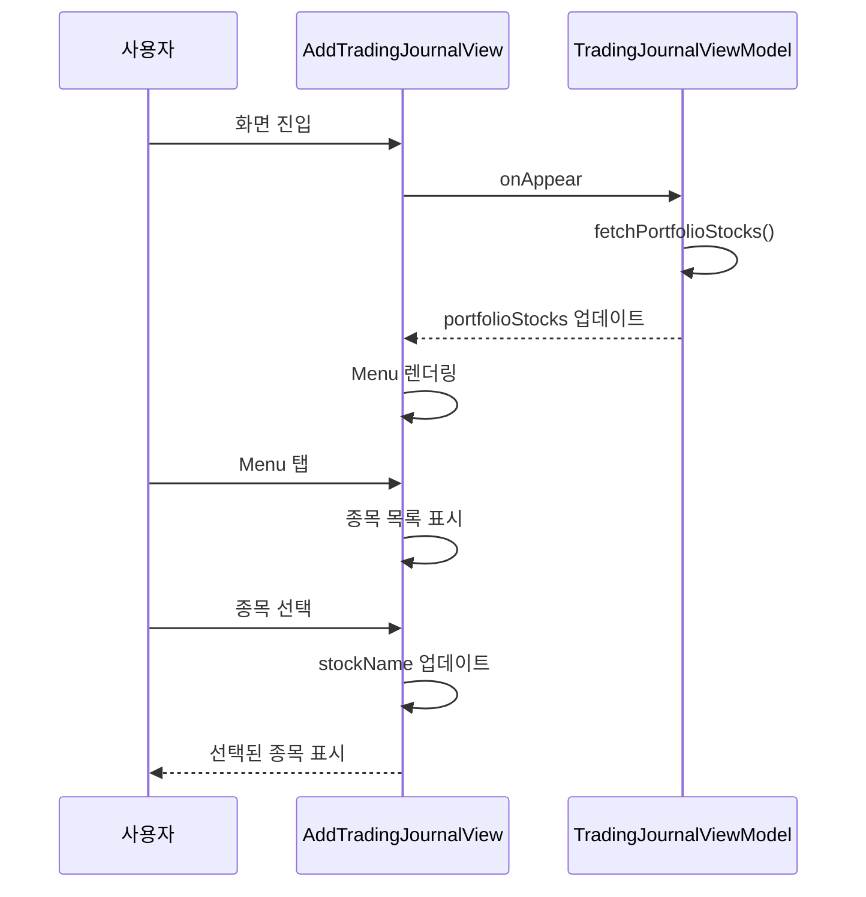
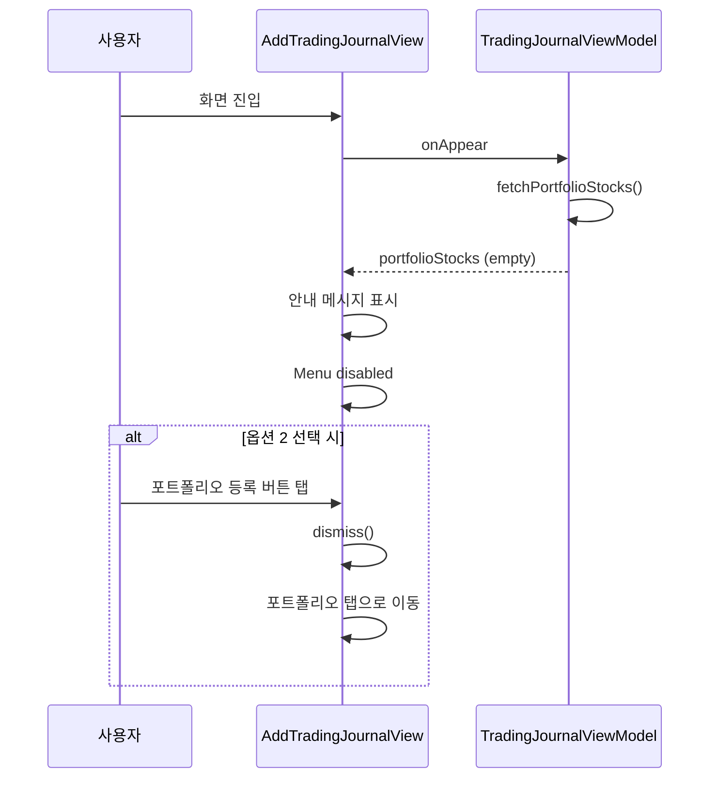
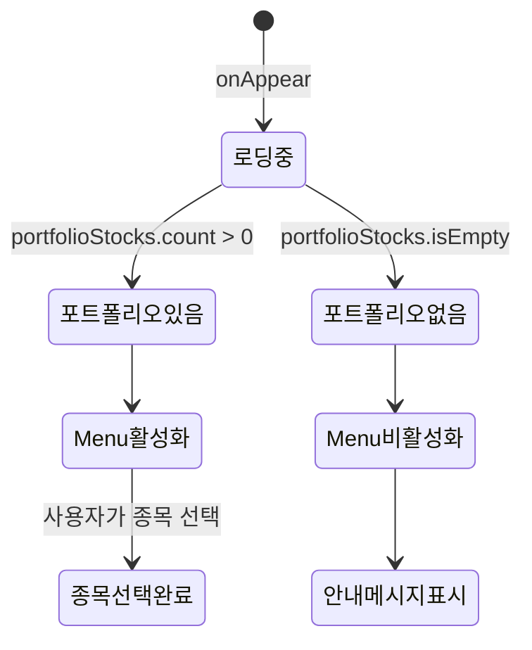

# 포트폴리오 종목 선택 화면 설계서

## 문서 정보

**버전:** v1.0
**최종 수정일:** 2024-12-24
**작성자:** Claude Code

## 변경 이력

### v1.0 (2024-12-24)
- 초기 작성
- 매매 일지 작성 화면 종목 선택 UI 설계 (Menu 방식)
- 빈 포트폴리오 처리 화면 정의
- 인터랙션, 접근성, 애니메이션 가이드 작성

## 1. 개요

### 1.1 목적
매매 기록 작성 화면에서 포트폴리오 종목을 선택하는 UI/UX를 설계합니다.

### 1.2 설계 범위
- 매매 일지 작성/수정 화면의 종목 선택 UI 변경
- 빈 포트폴리오 처리 화면

## 2. 화면 설계

### 2.1 매매 일지 작성 화면 (개선)

#### Before (기존)
```
┌─────────────────────────────────────────────┐
│  종목명                                     │
│  ┌─────────────────────────────────────┐   │
│  │  삼성전자                            │   │ ← TextField (직접 입력)
│  └─────────────────────────────────────┘   │
└─────────────────────────────────────────────┘
```

#### After (개선)
```
┌─────────────────────────────────────────────┐
│  종목명                                     │
│  ┌─────────────────────────────────────┐   │
│  │  삼성전자                    ▼      │   │ ← Menu (선택)
│  └─────────────────────────────────────┘   │
│  ┌─ Menu Popup ────────────────────────┐   │
│  │  삼성전자                            │   │
│  │  SK하이닉스                          │   │
│  │  NAVER                               │   │
│  │  카카오                              │   │
│  └─────────────────────────────────────┘   │
└─────────────────────────────────────────────┘
```

#### 전체 레이아웃
```
┌─────────────────────────────────────────────┐
│ [X] 매매 일지 작성                          │ ← NavigationBar
├─────────────────────────────────────────────┤
│                                             │
│  매매 유형                                  │
│  ┌─────────────┬─────────────┐            │
│  │   매수      │   매도      │  (Segmented)│
│  └─────────────┴─────────────┘            │
│                                             │
│  매매일                                     │
│  ┌─────────────────────────────────────┐   │
│  │  2024년 12월 22일          ▼       │   │
│  └─────────────────────────────────────┘   │
│                                             │
│  종목명                                     │
│  ┌─────────────────────────────────────┐   │
│  │  삼성전자                    ▼      │   │ ← 변경됨 (Menu)
│  └─────────────────────────────────────┘   │
│                                             │
│  수량                                       │
│  ┌─────────────────────────────────────┐   │
│  │  10                                  │   │
│  └─────────────────────────────────────┘   │
│                                             │
│  단가                                       │
│  ┌─────────────────────────────────────┐   │
│  │  75,000                              │   │
│  └─────────────────────────────────────┘   │
│                                             │
│  총액                                       │
│  ┌─────────────────────────────────────┐   │
│  │  750,000원                           │   │
│  └─────────────────────────────────────┘   │
│                                             │
│  매매 이유 (선택)                          │
│  ┌─────────────────────────────────────┐   │
│  │                                     │   │
│  └─────────────────────────────────────┘   │
│                                             │
├─────────────────────────────────────────────┤
│  ┌─────────────────────────────────────┐   │
│  │            [저장]                    │   │
│  └─────────────────────────────────────┘   │
└─────────────────────────────────────────────┘
```

### 2.2 종목 선택 Menu (확장 상태)

```
┌─────────────────────────────────────────────┐
│  종목명                                     │
│  ┌─────────────────────────────────────┐   │
│  │  삼성전자                    ▲      │   │ ← 활성 상태
│  └─────────────────────────────────────┘   │
│                                             │
│  ┌─────────────────────────────────────┐   │
│  │  NAVER                              │   │
│  ├─────────────────────────────────────┤   │
│  │  SK하이닉스                         │   │
│  ├─────────────────────────────────────┤   │
│  │  삼성전자                    ✓      │   │ ← 선택됨
│  ├─────────────────────────────────────┤   │
│  │  카카오                              │   │
│  └─────────────────────────────────────┘   │
└─────────────────────────────────────────────┘
```

### 2.3 빈 포트폴리오 처리

#### 옵션 1: 안내 메시지만 표시
```
┌─────────────────────────────────────────────┐
│  종목명                                     │
│  ┌─────────────────────────────────────┐   │
│  │  종목 선택                   ▼      │   │
│  └─────────────────────────────────────┘   │
│                                             │
│  ℹ️ 포트폴리오에 종목을 먼저 등록하세요   │
│                                             │
└─────────────────────────────────────────────┘
```

#### 옵션 2: 포트폴리오 등록 버튼 제공 (선택)
```
┌─────────────────────────────────────────────┐
│  종목명                                     │
│  ┌─────────────────────────────────────┐   │
│  │  종목 선택                   ▼      │   │
│  └─────────────────────────────────────┘   │
│                                             │
│  ℹ️ 포트폴리오에 종목을 먼저 등록하세요   │
│  ┌─────────────────────────────────────┐   │
│  │      포트폴리오 등록하러 가기         │   │
│  └─────────────────────────────────────┘   │
└─────────────────────────────────────────────┘
```

## 3. UI 컴포넌트 상세

### 3.1 종목 선택 Menu

#### 구현 코드
```swift
VStack(alignment: .leading, spacing: 8) {
    Text("종목명")
        .font(.subheadline)
        .foregroundStyle(.secondary)

    if viewModel.portfolioStocks.isEmpty {
        // 빈 포트폴리오 처리
        VStack(alignment: .leading, spacing: 12) {
            Menu {
                Text("등록된 종목 없음")
            } label: {
                HStack {
                    Text("종목 선택")
                        .foregroundColor(.secondary)
                    Spacer()
                    Image(systemName: "chevron.down")
                        .foregroundColor(.secondary)
                }
                .padding()
                .background(Color(.secondarySystemBackground))
                .clipShape(RoundedRectangle(cornerRadius: 8))
            }
            .disabled(true)

            HStack(spacing: 8) {
                Image(systemName: "info.circle")
                    .foregroundColor(.blue)
                Text("포트폴리오에 종목을 먼저 등록하세요")
                    .font(.caption)
                    .foregroundColor(.secondary)
            }
        }
    } else {
        // 정상 동작
        Menu {
            ForEach(viewModel.portfolioStocks, id: \.self) { stock in
                Button {
                    stockName = stock
                } label: {
                    HStack {
                        Text(stock)
                        if stockName == stock {
                            Spacer()
                            Image(systemName: "checkmark")
                        }
                    }
                }
            }
        } label: {
            HStack {
                Text(stockName.isEmpty ? "종목 선택" : stockName)
                    .foregroundColor(stockName.isEmpty ? .secondary : .primary)
                Spacer()
                Image(systemName: "chevron.down")
                    .foregroundColor(.secondary)
            }
            .padding()
            .background(Color(.secondarySystemBackground))
            .clipShape(RoundedRectangle(cornerRadius: 8))
        }
    }
}
.padding(.horizontal)
```

### 3.2 스타일 정의

#### 색상
```swift
// Menu Label
let labelColor = Color.primary
let placeholderColor = Color.secondary
let backgroundColor = Color(.secondarySystemBackground)

// Menu Item (선택된 항목)
let selectedItemColor = Color.accentColor

// 안내 메시지
let infoIconColor = Color.blue
let infoTextColor = Color.secondary
```

#### 타이포그래피
```swift
// 종목명 레이블
.font(.subheadline)
.foregroundStyle(.secondary)

// Menu Label 텍스트
.font(.title3)

// Menu Item 텍스트
.font(.body)

// 안내 메시지
.font(.caption)
```

#### 스페이싱
```swift
// VStack 간격
VStack(spacing: 8)

// 안내 메시지 아이콘-텍스트 간격
HStack(spacing: 8)

// 빈 포트폴리오 처리 영역
VStack(spacing: 12)
```

#### 코너 라디우스
```swift
.clipShape(RoundedRectangle(cornerRadius: 8))
```

## 4. 인터랙션 정의

### 4.1 종목 선택 플로우



### 4.2 빈 포트폴리오 처리



### 4.3 상태 전이도



## 5. 접근성

### 5.1 VoiceOver 지원

```swift
// Menu
.accessibilityLabel(stockName.isEmpty ? "종목 선택" : "선택된 종목: \(stockName)")
.accessibilityHint("탭하여 포트폴리오 종목 선택")

// Menu Item
.accessibilityLabel(stock)
.accessibilityHint(stockName == stock ? "현재 선택됨" : "탭하여 선택")

// 안내 메시지
.accessibilityLabel("포트폴리오에 종목을 먼저 등록하세요")
```

### 5.2 Dynamic Type
- 모든 텍스트 Dynamic Type 지원
- `.font(.title3)`, `.font(.caption)` 등 시스템 폰트 사용

### 5.3 색상 대비
- WCAG AA 준수
- 텍스트 대 배경: 4.5:1 이상
- Menu Label: `.foregroundColor(.primary)` 사용

## 6. 다크 모드 대응

### 6.1 색상 자동 적용
```swift
// 배경색
.background(Color(.secondarySystemBackground))  // 자동 대응

// 텍스트
.foregroundColor(.primary)    // 자동 대응
.foregroundColor(.secondary)  // 자동 대응

// 아이콘
.foregroundColor(.blue)  // 시스템 색상 자동 대응
```

### 6.2 라이트/다크 모드 비교

#### 라이트 모드
- 배경: 밝은 회색 (#F2F2F7)
- 텍스트: 검정 (#000000)
- Placeholder: 회색 (#8E8E93)

#### 다크 모드
- 배경: 어두운 회색 (#1C1C1E)
- 텍스트: 흰색 (#FFFFFF)
- Placeholder: 연회색 (#AEAEB2)

## 7. 애니메이션

### 7.1 Menu 펼치기/접기
```swift
// 기본 시스템 애니메이션 사용
// 별도 애니메이션 정의 불필요
```

### 7.2 종목 선택 시
```swift
// 체크마크 표시
.transition(.opacity)
.animation(.easeInOut(duration: 0.2), value: stockName)
```

### 7.3 안내 메시지 표시
```swift
// 페이드 인
.transition(.opacity)
.animation(.easeIn(duration: 0.3), value: viewModel.portfolioStocks.isEmpty)
```

## 8. 성능 최적화

### 8.1 데이터 로딩
- 화면 진입 시 한 번만 로드 (onAppear)
- @Published 속성으로 자동 업데이트

### 8.2 목록 렌더링
- ForEach로 효율적 렌더링
- 종목 수가 많을 경우 스크롤 가능 (Menu 자동 처리)

### 8.3 메모리 관리
- portfolioStocks는 String 배열 (경량)
- Entity 전체가 아닌 stockName만 추출

## 9. 테스트 시나리오

### 9.1 UI 테스트
- [ ] Menu 탭 시 종목 목록 표시
- [ ] 종목 선택 시 stockName 업데이트
- [ ] 선택된 종목에 체크마크 표시
- [ ] 포트폴리오가 비어있을 때 Menu 비활성화
- [ ] 안내 메시지 표시 (빈 포트폴리오)
- [ ] 다크 모드에서 색상 정상 표시

### 9.2 접근성 테스트
- [ ] VoiceOver로 Menu 접근 가능
- [ ] VoiceOver로 선택된 종목 읽기
- [ ] Dynamic Type 적용 시 레이아웃 유지
- [ ] 색상 대비 WCAG AA 준수

### 9.3 인터랙션 테스트
- [ ] 종목 선택 → 저장 → 목록에서 확인
- [ ] 포트폴리오 종목 추가 → 매매 기록 작성 화면에서 확인
- [ ] 포트폴리오 종목 삭제 → 매매 기록 작성 화면에서 제거 확인

## 10. 구현 우선순위

### Phase 1 (MVP)
1. Menu 컴포넌트 구현
2. 종목 선택 로직 연동
3. 빈 포트폴리오 처리 (안내 메시지만)

### Phase 2 (개선)
4. VoiceOver 지원
5. 애니메이션 추가
6. UI 테스트 작성

### Phase 3 (선택)
7. 포트폴리오 등록 바로가기 버튼
8. 검색 기능 (종목 수가 많을 경우)

## 11. 디자인 에셋

### 11.1 아이콘
- Menu 펼침: `chevron.down`
- Menu 접힘: `chevron.up` (자동)
- 선택 체크마크: `checkmark`
- 안내 아이콘: `info.circle`

### 11.2 색상 팔레트
```swift
// Primary Colors
let primaryText = Color.primary
let secondaryText = Color.secondary
let accentColor = Color.accentColor

// Background Colors
let background = Color(.systemBackground)
let secondaryBackground = Color(.secondarySystemBackground)

// Status Colors
let infoColor = Color.blue
```

## 12. 개발 참고 사항

### 12.1 관련 파일
- `/StockFolio/Views/AddTradingJournalView.swift` (수정)
- `/StockFolio/ViewModels/TradingJournalViewModel.swift` (수정)

### 12.2 추가 작업
- TradingJournalViewModel에 portfolioStocks Published 속성 추가
- TradingJournalViewModel에 StockRepository 의존성 주입
- fetchPortfolioStocks() 메서드 구현

### 12.3 기존 코드 변경 범위
- AddTradingJournalView: 종목명 TextField → Menu로 교체
- TradingJournalViewModel: 초기화 및 의존성 추가

## 13. 완료 기준

### UI 구현
- [ ] Menu 컴포넌트 정상 동작
- [ ] 종목 목록 올바르게 표시
- [ ] 선택된 종목 UI에 반영
- [ ] 빈 포트폴리오 처리 완료

### 품질
- [ ] VoiceOver 테스트 통과
- [ ] 다크 모드 테스트 통과
- [ ] Dynamic Type 테스트 통과
- [ ] UI 테스트 통과
