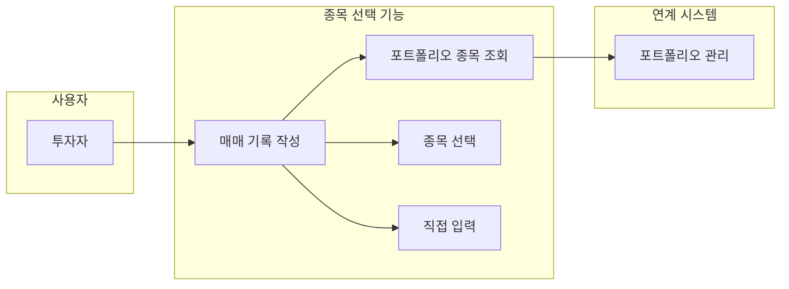
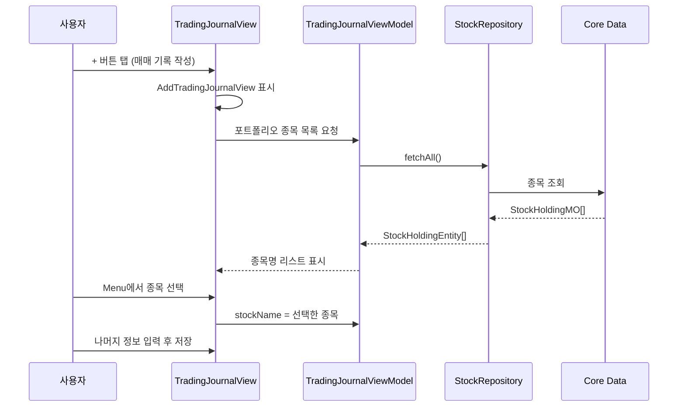
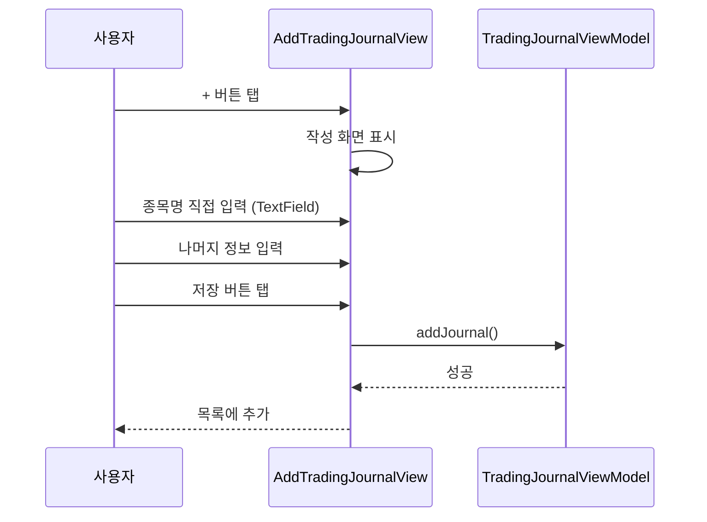
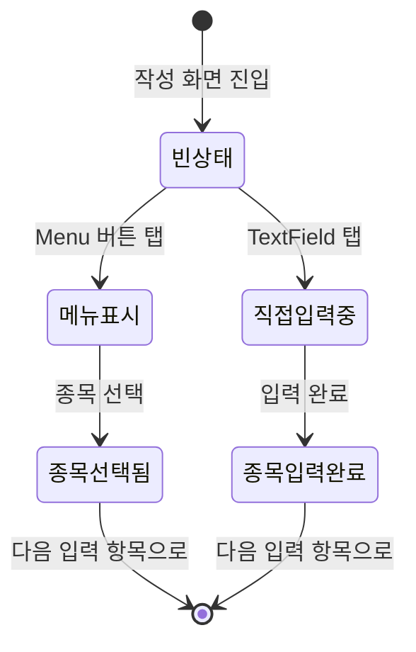

# 포트폴리오 종목 선택 유스케이스 명세서

## 1. 유스케이스 다이어그램



## 2. 시퀀스 다이어그램

### 2.1 종목 선택 플로우



### 2.2 직접 입력 플로우 (대체)



## 3. 유스케이스 상세

### UC-1: 포트폴리오 종목 선택

| 항목 | 내용 |
|------|------|
| **액터** | 투자자 |
| **사전조건** | 포트폴리오에 종목 1개 이상 등록됨 |
| **정상흐름** | 1. 매매 기록 작성 화면 진입<br>2. Menu 버튼 탭<br>3. 포트폴리오 종목 리스트 표시<br>4. 종목 선택<br>5. 종목명 자동 입력 |
| **예외흐름** | E1. 포트폴리오 종목 없을 시 빈 메뉴 표시<br>E2. Repository 조회 실패 시 에러 로깅 |
| **사후조건** | 선택한 종목명이 입력 필드에 자동 채워짐 |

### UC-2: 종목명 직접 입력

| 항목 | 내용 |
|------|------|
| **액터** | 투자자 |
| **사전조건** | 매매 기록 작성 화면 진입 |
| **정상흐름** | 1. 종목명 TextField 탭<br>2. 키보드로 직접 입력<br>3. 입력 완료 |
| **예외흐름** | E1. 빈 문자열 입력 시 저장 불가 |
| **사후조건** | 입력한 종목명이 매매 기록에 저장됨 |

### UC-3: 포트폴리오 종목 실시간 조회

| 항목 | 내용 |
|------|------|
| **액터** | 시스템 (자동) |
| **사전조건** | TradingJournalView 화면 표시 |
| **정상흐름** | 1. ViewModel이 StockRepository 주입받음<br>2. onAppear에서 포트폴리오 종목 조회<br>3. @Published 속성으로 UI에 반영 |
| **예외흐름** | E1. Repository nil일 경우 빈 리스트 |
| **사후조건** | 최신 포트폴리오 종목 목록이 메뉴에 표시됨 |

## 4. 상태 다이어그램

### 종목 입력 상태



## 5. 데이터 흐름

### Repository 의존성 주입

```
TradingJournalView
    ↓ @StateObject
TradingJournalViewModel(stockRepository: StockRepositoryProtocol)
    ↓ Dependency Injection
CoreDataStockRepository
    ↓
Core Data (StockHoldingMO)
```

### 데이터 변환

```
Core Data: StockHoldingMO
    ↓ Repository.fetchAll()
Domain Model: StockHoldingEntity[]
    ↓ map { $0.stockName }
View: String[] (종목명 리스트)
```
